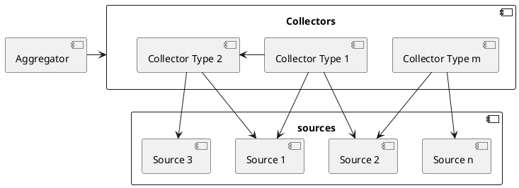
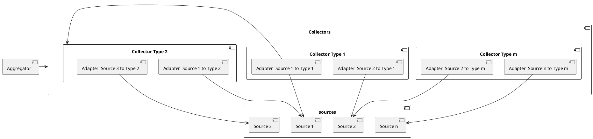
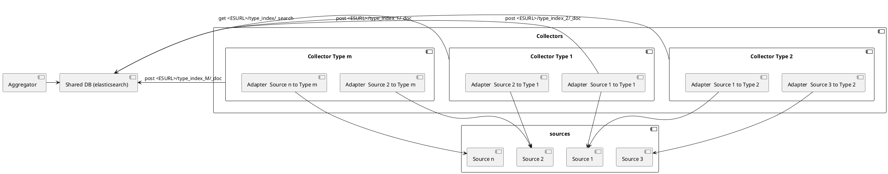
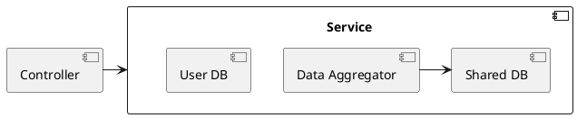
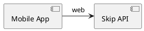
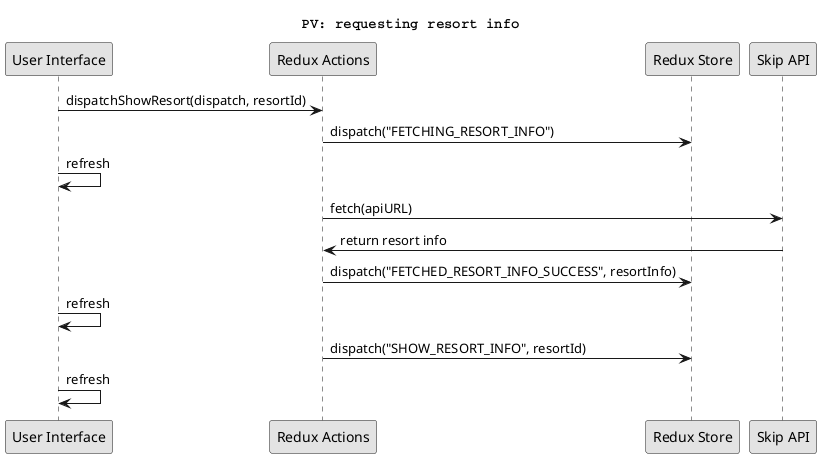

# 1-2

In this project we are using both adapters implemented by us and others
externally sourced.


The most prominent mimatch we find in our project is derived by the fact that
we are collecting data from different sources and have to reshape it for our
needs. Despite the components not communicating directly as they use a
shared database connector they still serve the role of adapting data, if not
through their interface by the way they ingest it in the shared database.

Each combination of data type and source needs its own adapter with
knowledge on how to retrive it and reshape it.

The following view (from ex10):




becomes with adapters:




We have omitted the shared database to better show the role of the connectors.
Adding it in we have the following:




The ```DataAggregator``` component is another adapter which queries the database and
converts the ingested data into a shape closer to what the client needs. For instance
an heatmap view (based on a specific criteria such as reviews, weather, affluency...)
or information about a specific resort. Clearly we can't expect the client
to analyze our database to extract the data he needs thus somewhere this missmatch
must be solved and the DataAggregator is the component serving that purpose.

Our "Redux Actions" component in the mobile application is an adapter masking
resquests to APIs and local storage and in general handling UI requests. A method
of its interface could for instance be

```
dispatchShowHeatMapOverview()
```

which would fetch the required data through our Skip API and dispatch an action
to update our redux store accordingly. More than solving a missmatch it seperates
the concern of having to deal with HTTP requests and actions on the local storage
from the UI.

Our ```Service``` component in the backend is an adapter tasked with using the various
databases and the DataAggregator component to provide actions close to what
our controller needs. For instance if the API is requested to handle a new
update on the snow conditions by one of our users the controller
will simply make a call along the lines of:

```
service.addSnowUpdate(snowInfo)
```

once validated the user credentials. Again more than solving a missmatch this component
separates concerns according to the ModelViewController pattern providing a simplified
interface for the controller to access (thus being a ```facade```).

Other examples of adapters are the ones implemented by the libraries we use to
connect with our database both on the front and backend. Different databases have
different interfaces and, if possible, we don't want to deal with them directly.
Our service layer should not change whether we use Postgress, MySql or SQLite.

# 3

The backend ```Service``` component can be considered a wrapper around the business
logic of our backend since the controller doesn't have to be aware of any components
used by it.

A view of it as follows:



wouldn't be entirely accurate since the databases runs independently. We can't
represent them as part of the service but the controller is not aware of that...


In general every API could be considered as a wrapping facade since it adapts functionality
we don't see the implementation of to an interface.

# 4

## HTTP

We are implementing a REST API for our application  and are also using
externally sourced APIs which will have to conform to HTTP specifications.

## SQL

We are using a SQL database to store data about our users. SQL is one of the
most used DSL for queries.

## GeoJson

We will need to work with geographic data and GeoJson is the most common data
model used for it.


# 5

We are looking at the facets of the following coupling:



## Binding

Binding between the two components is done at design-time. The mobile application
works by communicating with a back-end we design.

## Discovery

Discovery happens at deployment time likely in the form of an environment
variable with the url and credentials to access our API.


## Session

The backend API will conform to the REST specification (with a possible exception
made to manage authorization tokens which might expire for security reasons after
some time) so each message will be treated independently from each other.

## Interaction

The components are connected via a ```web``` connector so the connetion is
obviously remote.


## Timing

Both components must be running in order to exchange data.


## Interface

Any change in the API will potentially break the mobile app.

## Platform

No. The backend is running remotely so, as long as there are no interface changes,
the mobile app won't be aware of a platform change.

# 6

As mentioned before we need multiple adapters for the various sources of data
since each API will have its own data model.

For instance let's say we need the weather of a location:

A request to ```openweathermap``` will look as follows:

```
https://api.openweathermap.org/data/2.5/weather?q=Cortina,ita&appid={API key}
```

and will result in a response that looks like

```
{
"coord": {
  "lon": -0.13,
  "lat": 51.51
},
"weather": [
  {
    "id": 300,
    "main": "Drizzle",
    temp": 282.55,
    "feels_like": 281.86,
    "temp_min": 280.37,
    "temp_max": 284.26,
    "pressure": 1023,
    "humidity": 100
    "description": "light intensity drizzle",
    "icon": "09d"
  }
],
...
"wind": {
  "speed": 4.1,
  "deg": 80
},
"clouds": {
  "all": 90
},
...
"id": 2643743,
"name": "Cortina",
"cod": 200
}
```


while a request to ```onthesnow``` will be as follows:


```
https://onthesnow.com/externalservice/resort/{resortId}/{N}/day/forecast

```

and will result in a response that looks like:


```
{
  ...
currentWeather": {
    "snowfall": 0,
    "is_reported": true,
    "is_forecast": false,
    "tempTopMax": -10,
    "tempTopMin": -10.9,
    "tempBottomMax": -3.6,
    "tempBottomMin": -4.6,
    "tempTop": -6.7,
    "tempBottom": -6.7,
    "weatherSymbol": "SUN",
    "bottomWeatherSymbol": "SUN",
    "surfaceTop": 2,
    "surfaceBottom": 2,
    "surfaceTopOffSlope": 0,
    "surfaceBottomOffSlope": 0,
    "forecastDate": "2014-02-24",
    "lastModified": 1393225236,
    "date": 1393200000,
    "date_str": "2014.02.24 00:00:00 UTC",
    "lastModified_str": "2014.02.24 07:00:36 UTC",
    "date_local_str": "2014.02.24 00:00:00 UTC",
    "date_local": 1393200000
},
...
}
```


as we can see both provide similar data but in a completely different data model.
Our adapters will be tasked with converting this data to a common data model that
 the DataAggregator will be able to operate on.


As an example let's say that we want to work with weather data shaped as follows:

```
{
  location: {
    lat,
    lon,
    resortId,
    resortName,
    country
  },
  wind:{
    speed
  },
  temperature:{
    max,
    min
  },
  date:{
    timestamp,
  },
  mainType: "sun"|"rain"|"snow"
}
```

A weather collector will first need to fetch resort locations (these are already
ingested by a separate collector in our DB) from the proper index of our
database (js pseudocode):


```
asynch _getResorts(){
  resorts = (await fetch("${env.get(ELS_URL)}/resort/_search", method="PUT", body={
    query: {
      match_all: {}
      }
    })).body.toJson().hits.hits

    return resorts
}
```

then we have a method to get the weather from the resort info:


```
asynch _resortToResortWeather(resort){
  rawResortWeather = (await fetch("https://api.openweathermap.org/data/2.5/weather?q=${resort.name},
  ita&appid=${env.get("OWM_KEY")}, method="GET")).body.tojson()

  return {
    location: {
      lat: resort.lat,
      lon: resort.lon,
      resortId: resort.id,
      resortName: resort.name,
      country: resort.country
    },
    wind:{
      speed: rawResortWeather.wind.speed
    },
    temperature:{
      max: rawResortWeather.weather[0].temp_max,
      min" rawResortWeather.weather[0].temp_min,
    },
    date:{
      timestamp: (new Date()).timestamp,
    },
    type: {Drizzle:"rain", Sun: "sun", Rain: "rain", Snow:"snow", "Cloud":"cloud"}[rawResortWeather.weather[0].main]
  }
}
```


using onthesnow, beside the data model missmatch, we would have the additional
 issue of dealing with  the fact that we store our own collection of resorts while
 they have theirs and requests to their weather API need the ids of their resorts.
 We could to slightly modify our method to enrich the resorts with onthesnow IDs.


 ```
 asynch _getResorts(){
   resorts = (await fetch("${env.get(ELS_URL)}/resort/_search", method="PUT", body={
     query: {
       match_all: {}
       }
     })).body.toJson().hits.hits

     extResorts = (await fetch("https://onthesnow.com/externalservice/resort/", method="PUT")).body.toJson()

     resorts = resorts.map(r =>{
          oId = extResorts.filter(er=> er.name === r.name )[0]?.id
          return oId? {...r, oId: oId}: null
       }).filter(r=>!!r)

     return resorts
 }
 ```

 then similarly:


 ```
 asynch _resortToResortWeather(resort){
   rawResortWeather = (await fetch("https://onthesnow.com/externalservice/resort/${resort.oId}/1/day/forecast,
   ita&appid=${env.get("OWM_KEY")}, method="GET")).body.tojson()

   return {
     location: {
       lat: resort.lat,
       lon: resort.lon,
       resortId: resort.id,
       resortName: resort.name,
       country: resort.country
     },
     wind:{
     },
     temperature:{
       max: rawResortWeather.currentWeather.tempTopMax
       min" rawResortWeather.weather[0].tempBottomMin,
     },
     date:{
       timestamp: (new Date()).timestamp,
     },
     type: {Sun: "SUN", Rain: "RAIN", Snow:"SNOW", "cloud":"CLOUD"}[rawResortWeather.weatherSymbol]
   }
 }
 ```


 after that we would have to repeat the process for all resorts:


 ```
ingest(){
  resorts = await _getResorts()
  weatherPoints = Promise.awaitAll(resorts.map(_resortToResortWeather))

  body = weatherPoints.flatMap(wp => [{index:{}}, wp]).map(x => JSON.stringify(x)).join("\n")

  fetch("${env.get(ELS_URL)}/weatherPoints/_bulk", method="POST", body=body)
}
 ```


 once this collected data is ingested in the various indexes it can then be used
 by the DataAggregator component.


 # 7

All the couplings in the mobile application are quite straightfoward already. The
only component with more than one coupling is ```Redux Actions```, this component has
the responsability of handling requests from the UI and perform fetches if necessary.
To handle the possible outcomes of a request we  perform them one after the other
as shown in the process view of ex 8:





removing coupling between this component and the "LS Service" or the "Skip API"
would just make interactions more convoluted. The coupling between it and the "Redux Store"
is not direct as we communicate with it through the dispatch function. It is perhaps
similar to a bus connector.

Moving onto the API:

 We are using a shared DB for the various types of data and have all the collectors
 adapters access it as active components to ingest data instead of
 having another component call them :this only makes them coupled to the shape of the data
  they need to read and write so we can't make it looser.

 The backend "Service" component is coupled with the ```DataAggregator```,
 the ```User db``` and the ```Info db```: we could turn the ```DataAggregator``` into an active
 component writing directly to the ```Info db```. At this point the coupling between
 the ```DataAggregator``` and ```Service``` component would be cut. On the other hand moving
 the cache from the control of the now active ```DataAggregator``` would be necessary:
 we can proxy the fetch function to use a cache when calling our ```Info db```
  (or as a simpler approach just use a dedicated call to access it).

We would end up with the following connector view:


```puml
@startuml
component Mobile_App as APP {
   }
   component "proxy caller" as PX

   component "Skip API" as API
   APP --> API : web


   component "Service" as SERV1
   API -> SERV1: call


   component "User DB (mySql)" as DB1
   SERV1 -> DB1 : rpc

   component "Info db (elasticsearch)" as DB2
   SERV1 --> PX : call

   component "cache db (reddis)" as DB3


   DB3 <- PX : call
   PX -> DB2 : web

   component "Data aggregator" as DT


component "Data aggregator" as DT

component "Data collectors" as DC{

}

component "External APIs" as APIS

DC -> APIS: web
DC --> PX : call
DT --> PX : call
@enduml
 ```

 the ```proxy caller``` component could follow a very simple approach to maintain
 the cache which is to assume POST calls to our database are write operations
 (and the relevant index cache should be invalidated) while GET are always
 read operations.
