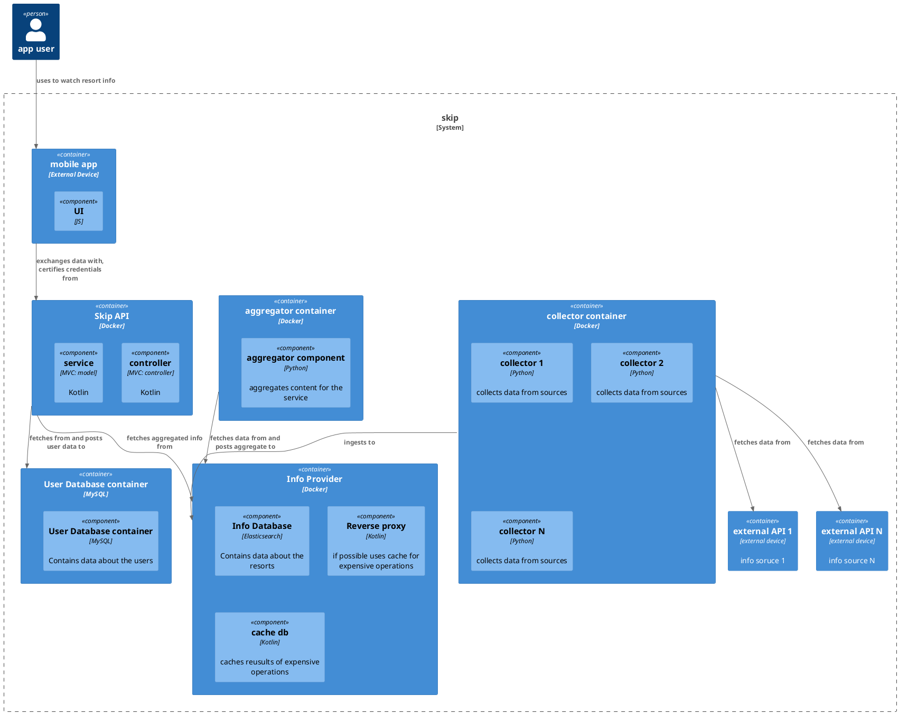
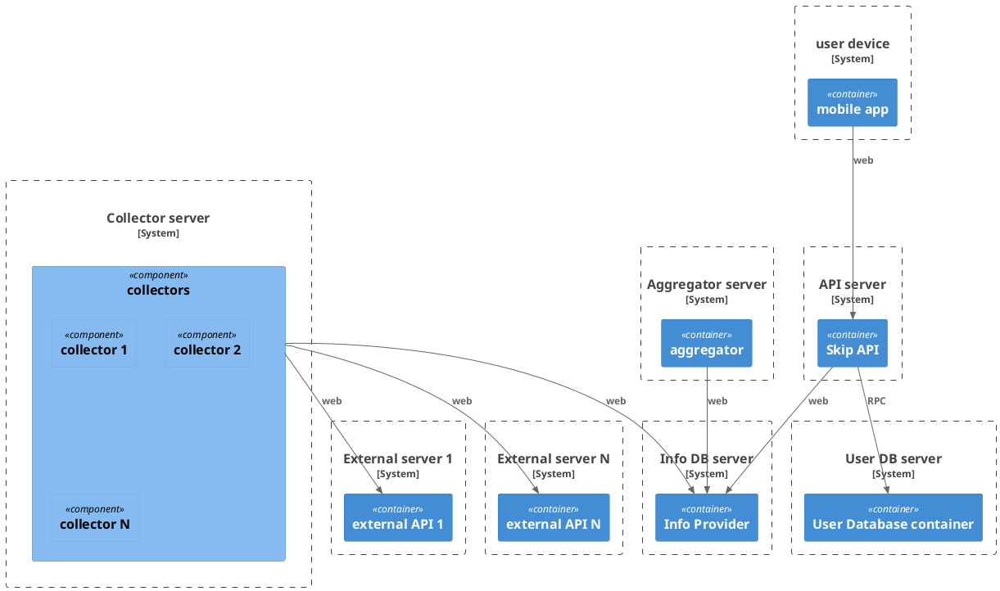

## Container view

## Deployment view

## Deployment strategy ADR

1. What did you decide?

What protocol skip should use to release a new version.

2. What was the context for your decision?

New releases are a critical moment in the life of an application, a bad release
can easily cause users to migrate to competitors. At the same time users expect
applications to improve over time and might not even agree that new features
are improvements.

3. What is the problem you are trying to solve?

We don't want to compromise the availability and reliability of our application
when releasing a new version. At the same time we want to avoid spending a
major amount of resources if possible.

4.  Which alternative options did you consider?

* canary
* shadow
* gradual pahse-in
* A/B
* Blue/Green
* Big Bang
* pilot

5. Which one did you choose?

canary -> gradual phase-in: front-end
back-end: canary

6. What is the main reason for that?

We want to give users some flexibility to update their application, at the same
time we don't want to confuse them with ulterior options to rollback their changes
and, at some point, we want all of them to move to the new version.

A gradual phase-in (obviously preceeded by testing with pilots) adapts quite well
to this requirements and doesn't need us to develop extra infrastructure. A
deployment with a canary approach might still be risky as canary users might
carry some bias which is why we complement it with a gradual phase-in.

The A/B method could be emplyed if there are strong doubts between two differently
designed versions of our applications but it might prove to be expensive to enact
and should be used carefully.

For the backend we are mostly interested in the fact that new updates won't
contain bugs and break the application so even users with biases will still work
which is why we go with a canary approach. With more resources we could compare
results users obtain from the new API with the old one via a shadow approach
but it would likley require tons of extra work.
