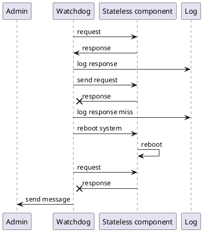
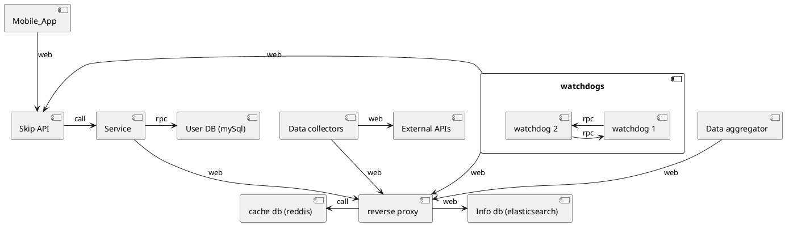

## 1

Our backend can already be hosted on a separate server as is. The connector
view won't change since we are using a web connector.

## 2

We could make our application subscription-based however this would heavily
impact the amount of users that would use it. We would also obtain
less data about waiting times and quality of the snow on the slopes.

Instead of putting a price on our service we believe the best solution to be
ad-based monetization as the vast majority of apps on mobile stores does.

## 3

Clearly the higher the availability of a service the better with that being
said we don't have high availability requirements as a medical application
or a service for an enterprise would have.

If possible it would be preferable if the downtime were to be distributed
during low usage preriods (such as the night or outside the skiing season).

Since our application would not need to perform many requests even a relatively high
response time of a few seconds would still be tollerable if aptly masked by the
UI of the app (ex: show some cute mascotte or a fake loading bar while waiting for
  the response). Realistically we should be able to receive a response within 1.

Since the service is offered for free we would expect our user to have a higher
tollerance for unplanned downtime yet longer ones (more then a few minutes)
would lead users to perceive our application as unreliable and possibly part from it.
A few occurrencies of longer downtime might be accepted even during periods of
high usage but we should attempt to avoid that as much as possible.

Downtime due to planned maintenance should rarely occour as we could just
redirect the requests of our users to an older version of the API. Were it needed
it should be done during times of low usage when would barely affect any users.


## 4

## ADR #1

1. What did you decide?

What system we should use to detect the availability of our service.

2. What was the context for your decision?

Our application uses multiple services that could experience downtime.


3. What is the problem you are trying to solve?

We want to monitor the availability of our services and external API, we use
to act occordingly if something is not working to fix it as soon as possible.

4.  Which alternative options did you consider?

* watchdog
* heartbeat


5. Which one did you choose?

watchdog

6. What is the main reason for that?

With a watchdog we don't need to add extra code to our services and we will be
also able to monitor their response time which is important to avoid compromising
the usability of our mobile app.


## 5
The watchdog will manage issues with the system differently, in case of a response
not received from the service it will attempt to restart the component (we assume
the watchdog to have priviledge access to the container running the service in order
to order a reboot). If that doesn't solve the problem its only recourse would be
to send a message to an admin. We use multiple watchdogs to monitor each other.




The system will be connected as follows:





## 6

## ADR #1

1. What did you decide?

What replication strategy to use for our databases.

2. What was the context for your decision?

It's impossible to have a database with all the following properties:

* partition tollerance
* consinstency
* availability

we have to decide what is is priority in our system and follow with an adequate
replication strategy for our database.


3. What is the problem you are trying to solve?

Since we need a distributed database in order to scale our application we need
to balance out availability and consistency in the best way possible for our users.


4.  Which alternative options did you consider?

* no replication
* synchronous replication
* asynchronous replication


5. Which one did you choose?

user db: synchronous replication

info db: asynchronous replication


6. What is the main reason for that?

We need to maintain consistency over our user database: if a user changes his
password we can't have the old one possibly working after confirming the change.
Only a few requests should be sent to this database so resulting slower response
time shouldn't be an issue.

For our info database eventual consinstency is enough, even if we don't provide
data from the latest state of our database there will be no issues. Since lots of
writes are performed on this database synchronous replication would significantly
hamper its performance. By default elasticsearch is a AP database.


Event sourcing with elasticsearch would be very expensive especially when considering
we might want to prune some data regularly (ex: we don't need to keep every weather
forecast especially after the day has passed and we have the actual data for it).


Event sourcing is eventually consistent so we exclude it for our user db.


## 7

We can already tollerate failures from the external API we use. If the API fails
we can't provide any usefult service from our mobile application so it will inevitably
fail.

Since our components communicate through a shared database its failure would make them
unable to continue operating, we could use a circuit breaker to avoid keep sending
requests to it or put the systems on hold after a certain amount of failures happen
within a determinate timeframe.

## 8

We are using external sources to fetch some of the data we need. If some experienced
downtime we could still offer older information already fetched and ingested from them
in the past. There is also some redundancy: we can get our weather both from ```openweathermap.org``` or ```onthesnow.com```
so if one went down we would still be able to serve a forecast on most resorts.
