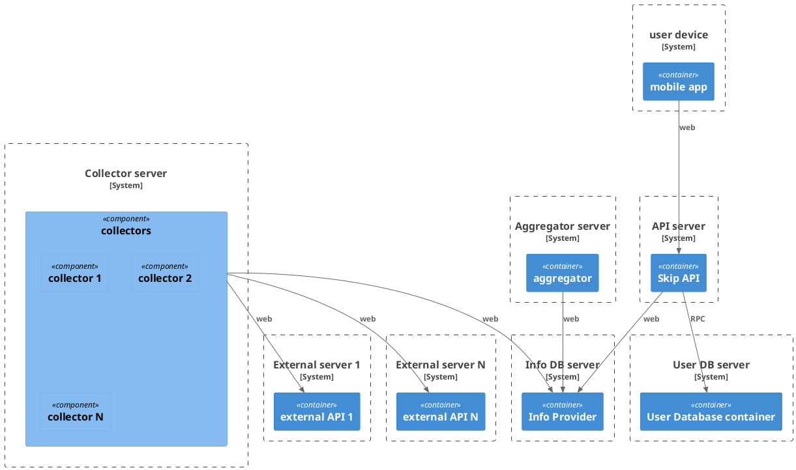
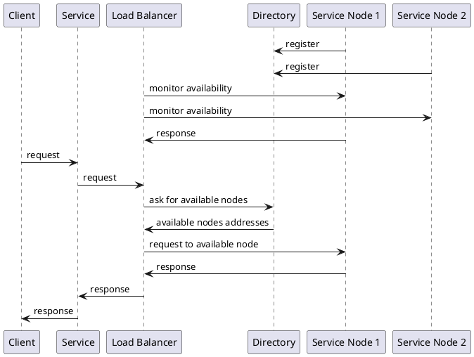

## 1

number of clients since it's most likely the one that could cause issues in our system.

## 2

At the moment it doesn't as there are a few potential bottlenecks:

* The API would fail to serve a large number of clients since it's a single instance
The API is a stateless service so we can easily horizontally scale it by having
multiple instances of it accessed through a load balacer. The standard DNS service
can already be configured to act as a load balancer so this would solve the related
issue which would work also if we were interested in making our application available
via browser in the future. Otherwise we could just add our own load balancer on top of it
Assuming the load balancer itself could become a bottleneck an alternative would be to
perform "load balancing" on the client side based perhaps on a mapping between location
and IP of the API, that seems excessive as a load balancer can scale vertically
very efficiently.

* While elasticsearch is by design horizontally scalable the we have put a reverse proxy
to use a cache on top of it which could have consequences on the scalability of the system.
We could use the already existng reverse proxy as a load balancer but this proxy has already the
task of using a cache which would prevent it from being a hardware based load balancer.
At this point the best option would likely be to add a dedicated load balancer for the
various nodes and move instead the cache on the API.

An advantage of having a proxy on top of all our requests to es was that we could
invalidate it once a write was seen, on the API we would instead be forced to have
a lower consinstency (ex: we could cache the information of a resort for a certain duration
  no matter what happens in our db, this would significantly reduce the needed
  requests to our dbs).

* At the moment the userDB is a single instance SQL-based DB which could struggle with many writes
For the user db MySQL Cluster is a solution adopted by many companies with high need
for scalability and consinstency like facebook. Similarly to the previous point we
could also use a load balancer here to split the traffic between the various nodes.

## 3

Logical view (arrow notation):

```puml
@startuml
skinparam componentStyle rectangle

!include <tupadr3/font-awesome/database>

title Logical View


component "Mobile App" as APP {

component "User Interface (React Native)" as UI
component "Redux Store (Redux + Thunk)" as RES
component "Redux Actions" as REA



component "LS Service (Realm)" as MSRV


component "Local Storage" as LS

UI -> REA
REA --> RES
REA -> MSRV
MSRV -> LS
}



component "Skip API service" as SA  {

component "Load Balancer" as LB1
component "Directory" as DIR1





component "Skip API (Kotlin + Spring framework)" as SA_{
component "Controller" as CTRL
component "Service" as SRV



component "User Repositories" as UREP
component "Cache db (Redis)" as CDB
CTRL -> SRV
SRV --> CDB
SRV -> UREP
LB1 -> SA_
LB1 -> DIR1
}



}






component "Data Aggregator" as AGG{

}


component "Data Collectors" as COL{
component "Snow Conditions Collector" as SNA

component "Weather Collector" as WA

component "Resort Info Collector" as RA

component "Geo Collector" as GA
}





component "Info storage service" as IDB{
component "Info db (elasticsearch)"  as IDB_
component "Load Balancer" as LB2
component "Directory" as DIR2

LB2->IDB_
LB2->DIR2
}


component "User storage service" as UDB{
component "User db (mySQL cluster)" as UDB_
component "Load Balancer" as LB3
component "Directory" as DIR3

LB3 -> UDB_
LB3 -> DIR3

}



component "External API" as EA{
component "weatherski" as AP1

component "skiapi" as AP2

component "onthesnow" as AP3

}


MSRV --> SA
SRV --> IDB
UREP -> UDB


COL --> EA
COL --> IDB
AGG --> IDB




skinparam monochrome true
skinparam shadowing false
skinparam defaultFontName Courier
@enduml

```

Deployment view: it remains unchanged since all components needing a load balancer
were already structured as independent services.

Process view: all our load balancers work in the following way:

## 4

1. What did you decide?

What patterns we should use to scale our application to accomodate a larger
number of users

2. What was the context for your decision?

We want our system to accomodate a larger number of clients but
it's not always possible simply pick a more powerful machine (scaling up).
Often doubling our resources in this manner does not double the throughtput of
our service which is way modern architerctures usually need to be able to
scale out to multiple machines.

3. What is the problem you are trying to solve?

We don't want the application to fail to perform due to a large number of
concurrent requests from our users.

4.  Which alternative options did you consider?

* Sharding
* Load balancing
* Master/worker

5. Which one did you choose?

Load Balancing + Sharding

6. What is the main reason for that?

Master/worker pattern does not apply to our case as we don't have issues scaling
our input nor would we have any straightfoward way  to split our input.

We are explicitly using load balancers to redirect requests to one of the available
nodes implementing our stateless API.

Sharding is the natural solution to scale out databases and most implementations
also comes with internal load balancing between the nodes.

In the vast majority of cases solutions like MySQL cluster and elasticsearch will
 be able to support a very large number of requests with their own load balancer.
 That being said the node elected as load balancer by the db might still be
 insufficient so and unable to further scale up to forward the requests which is way
 we have added our own load balancer. An example for this type of solution
 is configuring [ES to run using an external load balancer like
 Azure Resource Manager](https://www.elastic.co/guide/en/elastic-stack-deploy/current/azure-arm-template-load-balancing.html)

## 5

1. What did you decide?

What discovery solution to apply for our dependencies.

2. What was the context for your decision?

In many cases software dependencies are dynamic: we know statically that our software
needs a certain type of component but not which implementation might be available
and where to get it.

3. What is the problem you are trying to solve?

We don't want our software to fail because it doesn't know which component implementations
are available and how to reach them.

4.  Which alternative options did you consider?

* Directory
* Injection

5. Which one did you choose?

Directory

6. What is the main reason for that?

DNS is a form of directory based load-balacing and we have no controll over that.

We are also using load balancers to scale out which work with a directory.
