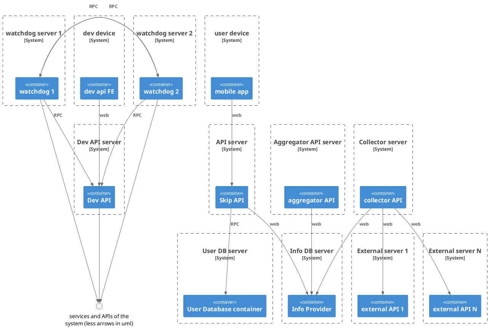
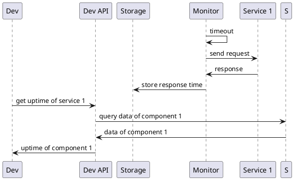
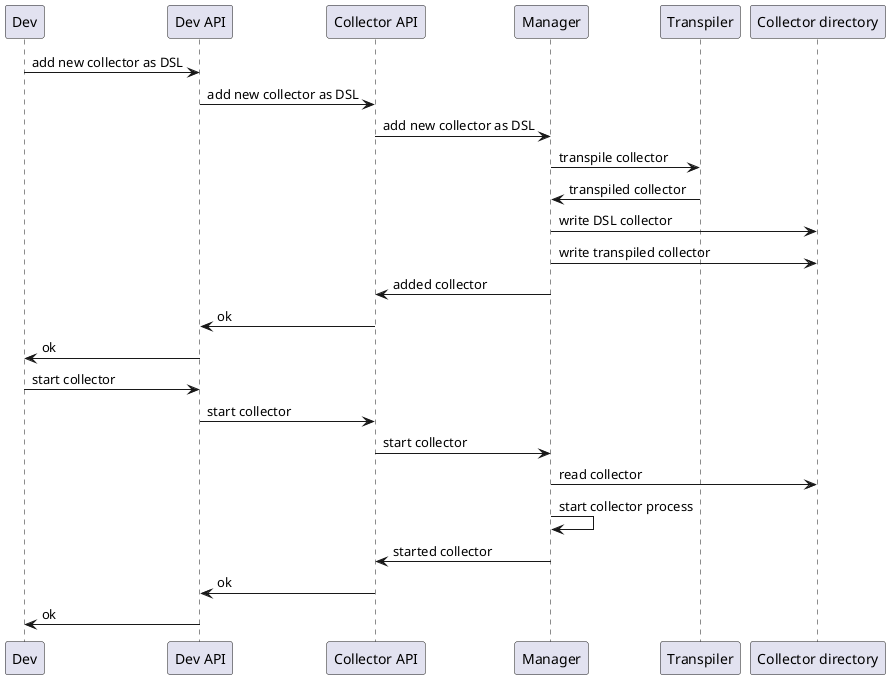

## 1

Data collectors are one of the key components of our application: they retrive
the raw data we need and ingest it. Each of them uses a source of information
and converts the data to the mapping of we use for that type of data.
Some data might come from an external API while other from ```json```
 other types of file, the location of which could be local or remote.
Given we might potentially use tens or even hundreds of different sources a tool
to streamline the process of writing a collector, testing it and monitoring or
tweaking (ex: change activation timer on a collector) its function could prove to be useful.

 We want to implement our own DSL to write a collector that is transpiled to
 our implementation language. Programmers would still have the possibility to
 write a collector manually. In practice we could simply have a directory containing
 the collectors in our ```.ourdsl``` format and another where they get compiled
 into ```.ourlang``` files.

 Together with information about the collectors it would be usueful to have a platform
 to monitor the state of our application.


Some of the active components of our application write to our database and we could
query the data written on it as a sort of pseudo-heartbeat monitoring however this
would not be an effective strategy as:

* The issue might be with the data source and not with our component, we need to
distinguish the different cases


* We might want to test how much time some of our components take to elaborate
data and store this information over time. Perhaps a collector fetching from a
particularly poor API isn't able to provide data consinstently which we might know
about

Since we want to keep our components to keep operating alone we opt to turn them
into passive components but add a manager on top of them which runs them at specified
intervals of time or on request. In order to send these requests we add an API to manage
and monitor the component.


Logical view:

```puml

@startuml
skinparam componentStyle rectangle

!include <tupadr3/font-awesome/database>

title Logical View


component "Mobile App" as APP {

component "User Interface (React Native)" as UI
component "Redux Store (Redux + Thunk)" as RES
component "Redux Actions" as REA



component "LS Service (Realm)" as MSRV


component "Local Storage" as LS

UI -> REA
REA --> RES
REA -> MSRV
MSRV -> LS
}



component "Skip API service" as SA  {

component "Load Balancer" as LB1
component "Directory" as DIR1





component "Skip API (Kotlin + Spring framework)" as SA_{
component "Controller" as CTRL
component "Service" as SRV



component "User Repositories" as UREP
component "Cache db (Redis)" as CDB
CTRL -> SRV
SRV --> CDB
SRV -> UREP
LB1 -> SA_
LB1 -> DIR1
}



}






component "Data Aggregator API" as AGG{

component "Controller" as ACTRL
component "Manager" as AMAN
component "Data Aggregato" as AGG_


ACTRL --> AMAN
AMAN --> AGG_


}


component "Data Collector API" as COL{

component "Controller" as CCTRL
component "Manager" as CMAN
component "Transpiler" as TRS
component "Directory of Collectors" as CDIR
component "Collector 1" as COL1

component "Collector 2" as COL2

CMAN --> COL1
CMAN --> COL2
CCTRL --> CMAN
CMAN --> TRS

}



component "Dev API" as DAPI{
component "Controller" as DCTRL
component "Monitor" as DM
component "Storage" as DS

DCTRL -->  DM
DCTRL -->  DS

}

component "Watchdogs" as WS {
component "Watchdog 1" as W1
component "Watchdog 2" as W2

W1 -> W2 : monitors
W2 -> W1 : monitors



}

component "Services collection to save arrows on this uml" as SRVS {
component "Info storage service"
component "User storage service"
component "Data Collector API"
component "Skip API service"
}


component "Info storage service" as IDB{
component "Info db (elasticsearch)"  as IDB_
component "Load Balancer" as LB2
component "Directory" as DIR2

LB2->IDB_
LB2->DIR2
}


component "User storage service" as UDB{
component "User db (mySQL cluster)" as UDB_
component "Load Balancer" as LB3
component "Directory" as DIR3

LB3 -> UDB_
LB3 -> DIR3

}



component "External API" as EA{
component "weatherski" as AP1

component "skiapi" as AP2

component "onthesnow" as AP3

}


MSRV --> SA
SRV --> IDB
UREP -> UDB


COL --> EA
COL --> IDB
AGG --> IDB



WS --> SRVS
DAPI --> SRVS
WS --> DAPI


skinparam monochrome true
skinparam shadowing false
skinparam defaultFontName Courier
@enduml
```




Deployment view:




Process view 1, visualizing service availability:



Process view 2, writing and starting DSL collector:




## 3
For what concerns our data sources:

We have designed our system to witstand breaking API changes: each API has
a different dedicated collector for each type of data we extract from it so that
would be the only thing to rewrite. Writing a new collector should also be faster
 due to the dedicated DSL.

We have put in place a system to monitor issues of this type with the collector
manager storing informations about the operation of each collector which are then
made available to the developer through the dedicated API.


The application wouldn't suddently break but, at worse, potentially serve
obsolete data if nothing better is available in the Information database.

We don't depend on other APIs at runtime and changes in those we use to deploy
our services would be discovered at deployment time.
