title:
Software Architecture Model
---

# Getting started

You will use [Markdown](https://www.markdownguide.org/cheat-sheetplan) and [PlantUML](https://plantuml.com/) to describe a software architecture model about your own project.

This document will grow during the semester as you sketch and refine your software architecture model.

When you are done with each task, please push so we can give you feedback about your work.

We begin by selecting a suitable project domain.


# Ex - Domain Selection

{.instructions

Submit the name and brief description (about 100 words) of your domain using the following vision statement template:

```
For [target customers]
Who [need/opportunity/problem]
The [name your project]
Is  [type of project]
That [major features, core benefits, compelling reason to buy]
Unlike [current reality or competitors]
Our Project [summarize main advantages over status quo, unique selling point]
```

Please indicate if your choice is:

* a project you have worked on in the past (by yourself or with a team)
* a project you are going to work on this semester in another lecture (which one?)
* a new project you plan to build in the future
* some existing open source project you are interested to contribute to

The chosen domain should be unique for each student.

Please be ready to give a 2 minute presentation about it (you can use a slide but it's not necessary)

Hint: to choose a meaningful project look at the rest of the modeling tasks which you are going to perform in the context of your domain.

}

Project Name: *My Project*

Project Type:

Vision Statement:

Additional Information:


#::::::::::::::::::::::::::::::::::::::::::::::::::::::::::::::::::::::::::::::


For skiers
Who are deciding where to spend their day
The Skip app
Is  an application for mobile devices
That allows skiers upload and visualize information ubout the current state of the slopes.
Unlike companies that manage the slopes Skip provides its users with unbiased information on the state of the snow.
There are websites that host reviews of ski resorts  but those are permanent reviews and likely not based on the present snow conditions.
Skiers may also use forums to monitor the snow conditions (ex: https://www.skiforum.it/board/index.php?threads/55613/page-1966) but this
requires the user to sift trhough multiple messages in the hopes of finding the information he needs
Our Project provides information and up to date data on the ski resorts close to the user at a glance.
This information is provided by users through a quick submission designed to be compiled in less than 30s.
Reviews by users are weighted based on how recent they are and expire after a while so that the information on the slopes is always up to date.


# Ex - Architectural Decision Records

{.instructions

Software architecture is about making design decisions that will impact the quality of the software you plan to build.

Let's practice how to describe an architectural decision. We will keep using ADRs to document architectural decisions in the rest of the model.

Use the following template to capture one or more architectural design decisions in the context of your project domain

Pass: 1 ADR

Good: 2 ADR

Exceed: >2 ADR

}


# Ex - Quality Attribute Scenario

{.instructions

1. Pick a scenario for a specific quality attribute. Describe it with natural language.

2. Refine the scenario using the following structure:

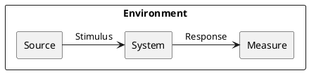

*Stimulus*: condition affecting the system

*Source*: entity generating the stimulus

*Environment*: context under which stimulus occurred (e.g., build, test, deployment, startup, normal operation, overload, failure, attack, change)

*Response*: observable result of the stimulus

*Measure*: benchmark or target value defining a successful response

Pass: 3 scenarios

Good: >3 scenarios

Exceed: >6 scenarios using challenging qualities

}


## Example Scenario

Quality: _Recoverability_

Scenario: In case of power failure, rebooting the system should take up to 20 seconds.

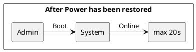


#::::::::::::::::::::::::::::::::::::::::::::::::::::::::::::::::::::::::::::::

## ADR #1

1. What did you decide?

Which platform should Skip run on.

2. What was the context for your decision?

We want to guarantee Skip users a good compromise of usability and utility at a
reasonable development cost.

The application should be as immediate as possible to access and push users to
give updates on the conditions of the slopes.

Another important factor to keep in mind is the 'effort' that would be required
from the users part to start using the application for instance using a web app
doesn't require any installations.

This is a key decision that affects the marketing and design architecture of
the whole software:


* From a coding perspective programming languages available across platforms
are not the same. We also need to keep in mind that available computing power
vastly differs platform to platform

* Best UI practices vastly differs on different platforms for instance a phone
has a smaller screen size and ratio compared to a desktop PC

* There are revenue consequences based on these decisions, for instance mobile
app stores will take a portion of our profits but at the same time offer a more
ample access to the marketing


3. What is the problem you are trying to solve?

What's the best way for users to access our service?

4.  Which alternative options did you consider?

* Web app
* Mobile app
* Desktop
* Mobile + Desktop

5. Which one did you choose?

Mobile

6. What is the main reason for that?

Users need an interface to quickly access the applicable features and give updates
on the condition of the snow while on the slopes. Given most users will go skiing
with their smartphones rather than their computers we need to make the app available
on them. We can do so either via web app or mobile application, web apps tend to
be hard to use while on the snow so we need at least mobile app.

The application doesn't feature complex user interactions that would justify
the need of a desktop version. We also need to consider that a user from a Desktop
might use the app to evaluate the condition of the slopes but likely won't come
back home to open it again to provide feedback on their conditions which is something
our application needs.

PROS:

* not developing also a Desktop app saves component
* the app store gives a large market access on the fly
* the application will be easily accessible while skiing
* it's easier to have a good design on a mobile app rather than a web apps


CONS:

* revenue cut by app stores
* users without a smartphone won't be able to access the application
* more effort required from the users part to start using the application compared
to a web app
* more expensive to develop a web app compared to a mobile one


## ADR #2

1. What did you decide?

Which mobile OS should the application run on?

2. What was the context for your decision?

We want our application to be accessible to the largest possible amount of users.
We need to consider that developing an app on multiple OS has a considerable impact
on developing costs.
Different technologies are available on different OS so this choice will impact
our code.


3. What is the problem you are trying to solve?

How can we make the application available to a large portion of our potential
users without a heavy impact on its usability and development costs?


4.  Which alternative options did you consider?

* Android
* IoS
* X-platform
* (Android & IoS) native

5. Which one did you choose?

X-platform

6. What is the main reason for that?

Excluding on of the OS would cut out a significant portion of our users as currently
the split between Android/Apple devices is roughly 7:3.
A x-platform solution allows to access both markets while at the same time
not bloating maintenance and development costs.
The tradeoff is in usability.

PROS:

* access to nearly all potential users
* less expensive compared to a native solution

CONS:

* more expensive compared to a single OS solution
* no access to native OS specific features


## ADR #3

1. What did you decide?

Which framework to use to implement the X-platform app.

2. What was the context for your decision?

Developing the application with a feature rich and reliable framework will
reduce costs and deliver a better product.

Programmers need to be able to work with the framework thus either they are
already comfortable with it or they will need to learn how to use it.

This decision has an impact on the code design.


3. What is the problem you are trying to solve?

How can we make our app as easy to implement as possible?

4.  Which alternative options did you consider?

* React native
* Flutter

5. Which one did you choose?

Not enough information to pick one yet. Further options need to be explored.

6. What is the main reason for that?

//


## ADR #4

1. What did you decide?

How we should gain money from the application

2. What was the context for your decision?

We need to make a profit from our application.

We need to consider that certain solution will impact the amount of users of the
application (ex: making the app paid) or impact the usability (ex: aggressive ads)

This decision is a marketing one but might slightly impact UI design and code if
we want to add ads to the application. For donations we will need to implement
a secure way to send them code-wise.


3. What is the problem you are trying to solve?

How can we profit from the application?

4.  Which alternative options did you consider?

* paid application
* free application with ads
* free application with donations

5. Which one did you choose?

free application with ads

6. What is the main reason for that?

An application can only be paid if it offers a service indispensable for the
user while at the same time being by far the best
product available on the market (ex: photoshop).
Users will be very shy to download a paid app on the a mobile store in part given
the fierce competition on it.
That being said making the app paid would surely reduce the amount of users
in turn reducing the amount of snow updates we get from them.

At the cost of some usability ads can provide a steady flow of revenue without
the big barrier on the download an initial payment would be. We could also
consider the option to remove ads with a payment.

Donations don't impact the usability of the app but likely don't provide enough
revenue. More research would be needed on this topic to confirm it as there seem
to be conflicting opinions on the topic.


PROS:

* steady flow of revenue
* no download barrier

CONS:

* usability tradeoff
* need to change UI to fit ads


## ADR #5

1. What did you decide?

How to incentivise users to give snow updates

2. What was the context for your decision?

We want users to provide as much updates on the condition of the snow as possible
to offer consistent and up to date reports.

We can't make the feedback too long or invasive or users won't compile it.

The incentives can't heavily impact the profits of our application.

This is a marketing decision with a minor impact on the code of the application
albeit way to give incentives will have to be implemented.

3. What is the problem you are trying to solve?

Users might not provide updates if they don't feel they gain something from it.
At the same time an incentive perceived as too large might prompt them to
leave fake updates

4.  Which alternative options did you consider?

* no incentives
* small payment
* lottery

5. Which one did you choose?

lottery

6. What is the main reason for that?

By providing no incentives it would be up to the user's goodwill to leave updates
which might still happen (reviews exist even if no one gets paid for them).

We could issue small payment to users for their updates but these payments would
be so small in order to still manage to make a profit off the app that users might
perceive them as a 'job' they are not getting paid enough to do.

A lottery of ski related items might be the best options since it doesn't cost
much compared to the perceived value from the user's part and might also introduce
the fun factor.

PROS:
* incentive for the users

CONS:

* lotteries have to abide legal regulations
* lottery still impacts operating costs albeit in a minor way
* it might incentivise users to leave fake updates. A countermeasure needs to be
designed.


# Ex - Quality Attribute Tradeoff

{.instructions

Pick a free combination of two qualities on the [map](https://usi365.sharepoint.com/:x:/s/MSDE-2022-SoftwareArchitecture/ESVksoXVgMNHtKBKrIwatMYBqorOFaKjxnoqssEy0gNPCg?e=81W7SI) and write your name to claim it.

Then write a short text giving an example for the tradeoff in this assignment.

Pass: 1 unique trade-off

Good: 2 trade-offs

Exceed: >2 trade-offs

}


#:


## Example Scenario 1

Quality: _Affordability_ , _Portability_ , _Deployability_

Scenario: The code written for the application is compatible with both Android
and IoS  with none or relatively trivial changes costing little effort,
time and money to be deployed on both OS at the same time once the code is written.

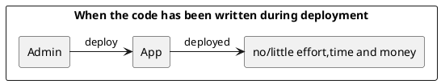


## Example Scenario 2

Quality: _Interoperability_ , _Usability_

Scenario: The software should be able to fetch data from multiple weather APIs
in order to provide users with reliable data over a vast amount of locations.
The fetching and elaboration of this data to a usable summary should be done
server side for efficiency and speed.
 Our server should act as an adaptor over the whole data for the application.

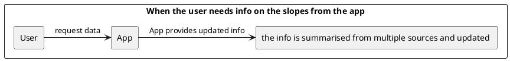


## Example Scenario 3

Quality: _Usability_ , _Performance_

Scenario: The survey the user completes to provide the us with updates on
snow conditions should on average take less than 30s to complete.

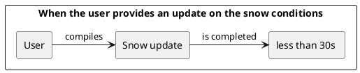


## Example Scenario 4

Quality: ? maybe it's functional ?

Scenario: The application should be able to store a snow update in case of
poor connection (as often is on the slopes) for at least a few hours and send
the data later to our server without having the user compile another snow update.


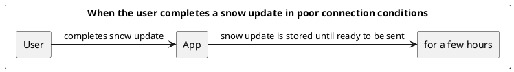


## Example Scenario 5

Quality: _Availability_

Scenario: The application should have an uptime of at least 99.5% for weather
and slope info assuming a connection is available.

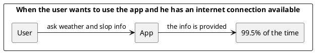


## Example Scenario 6

Quality: _Deployability_ , _Maintainability_

Scenario: The whole software (app + server) should have a test coverage of
at least 95% when deployed and for its whole lifecycle.

Without said requirement an automatic pipeline should fail the deployment.


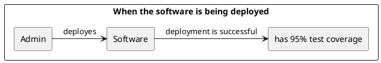


## Example Scenario 7

Quality: _Visibility_ , _Maintainability_ , _Privacy_

Scenario: When the service of the App is not available the application should
show the user a clear message stating the reason. If the reason is a fault in
the software a log should be sent to the developer not containing sensible user
data.


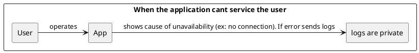


# Ex - Feature Modeling

{.instructions

In the context of your chosen project domain, describe your domain using a feature model.

The feature model should be correctly visualized using the following template:


If possible, make use of all modeling constructs.

Pass: Include at least 4 non-trivial features

Good: Include at least 6 non-trivial features, which are all implemented by your project

Exceed: Include more than 8 non-trivial features, indicate which are found in your project and which belong to one competitor

}


#:::::::::::::


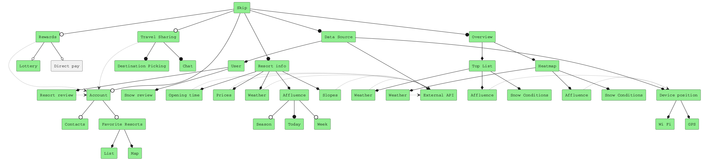


# Ex - Context Diagram

{.instructions

Prepare a context diagram to define the design boundary for your project.

Here is a PlantUML/C4 example to get started.


Make sure to include all possible user personas and external dependencies you may need.

Pass: 1 User and 1 Dependency

Good: >1 User and >1 Dependency

Exceed: >1 User and >1 Dependency, with both incoming and outgoing dependencies

}


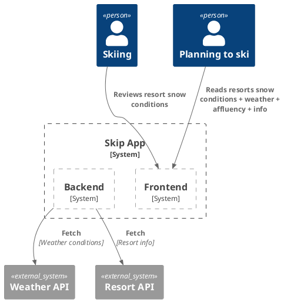


# Ex - Component Model: Top-Down

{.instructions

Within the context of your project domain, represent a model of your modular software architecture decomposed into components.

The number of components in your logical view should be between 6 and 9:

- At least one component should be further decomposed into sub components
- At least one component should already exist. You should plan how to reuse it, by locating it in some software repository and including in your model the exact link to its specification and its price.
- At least one component should be stateful.

The logical view should represent provide/require dependencies that are consistent with the interactions represented in the process view.

The process view should illustrate how the proposed decomposition is used to satisfy the main use case given by your domain model.

You can add additional process views showing how other use cases can be satisfied by the same set of components.

This assignment will focus on modularity-related decisions, we will worry about deployment and the container view later.

Here is a PlantUML example logical view and process view.

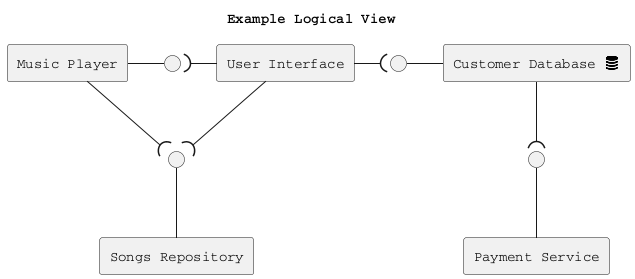

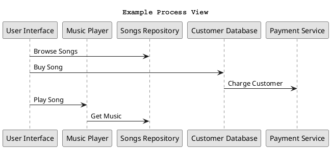

Hint: How to connect sub-components to other external components? Use this pattern.

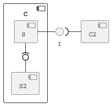

Pass: 6 components (1 decomposed), 1 use case/process view

Good: 6 components (1 decomposed), 2 use case/process view

Exceed: >6 components (>1 decomposed) and >2 use case/process view

}


#:


## Logical View

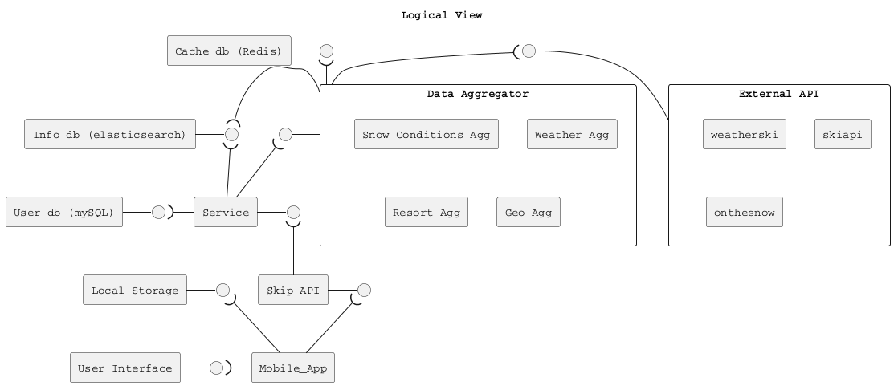


## Process Views


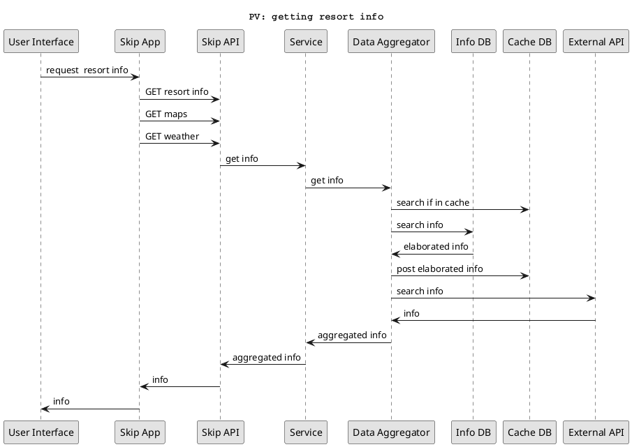


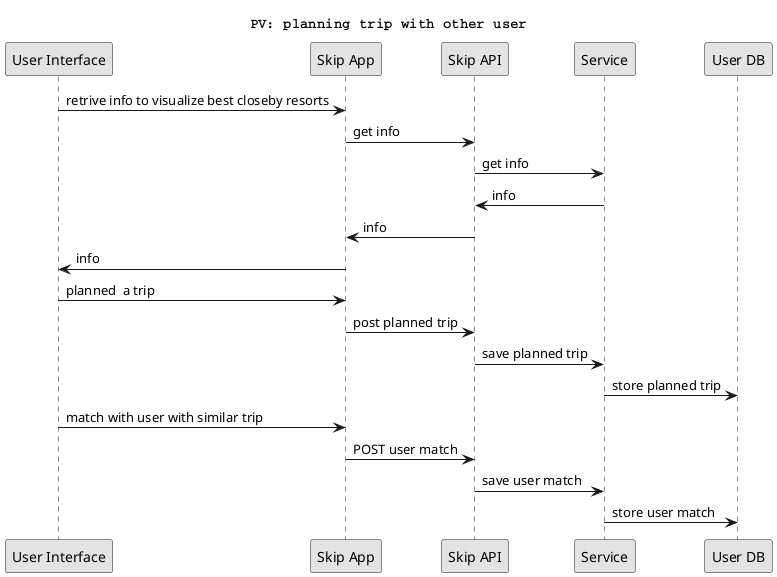


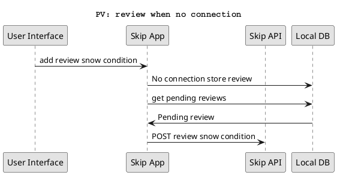


```
"Data aggregator" and "External API" sub-components are not connected.
```

# Ex - Component Model: Bottom-Up

{.instructions

Within the context of your project domain, represent a model of your modular software architecture decomposed into components.

To design this model you should attempt to buy and reuse as many components as possible.

In addition to the logical and process views, you should give a precise list to all sources and prices of the components you have selected to be reused.

Write an ADR to document your component selection process (indicating which alternatives were considered).

Pass: Existing design with at least 1 reused components (1 Logical View, 1 Process View)

Good: Existing design with at least 3 reused components (1 Logical View, 1 Process View, 1 ADR)

Exceed: Redesign based on >3 reused components (1 Logical View, >1 Process View, >1 ADR)

}


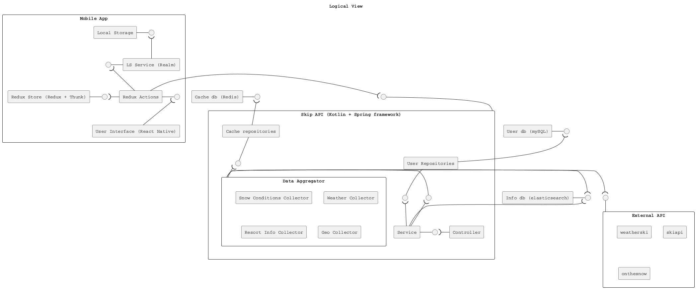


|


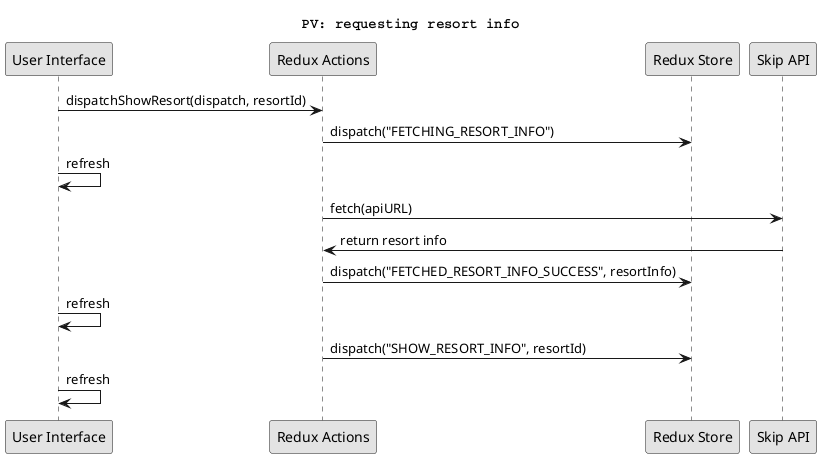


|


```puml
@startuml
title PV: Computing overview

participant "Service" as P1
participant "Data Aggregator" as P2
participant "Snow Condition Collector" as P3
participant "Weather Collector" as P4
participant "Resort Info Collector" as P5
participant "Geo Info Collector" as P6
participant "onthesnow.com" as P7
participant "openweathermap.org" as P8
participant "rapidapi.com/ski-resorts-and-conditions" as P9
participant "info DB" as P10
participant "cache repositories" as P11


P1 -> P2: getHeatMapOverviewData()
P2 -> P11: cacheRepositories.HeatMap.search(nKm)
P11 -> P1: data

P2 -> P3: getGlobalWeatherConditions()
P3 -> P11: cacheRepositories.Weather.search(nKm)
P11 -> P3: data
P3 -> P8: fetch(openWeatherUrl)
P8 -> P3: data
P8 -> P11: add data to cache
P3 -> P2: formatted data

P2 -> P4: getGlobalSnowConditions()
P4 -> P11: cacheRepositories.SnowConditions.search(nKm)
P11 -> P4: data
P4 -> P7: fetch(onTheSnow)
P7 -> P4: data
P4 -> P9: fetch(skiCondionUrl)
P9 -> P4: data
P4 -> P10: fetch(elasticSearchUrl, {body: esQuery})
P4 -> P11: add data to cache
P10 -> P4: data
P4 -> P2: formatted data


P2 -> P5: getGlobalResortList()
P5 -> P11: cacheRepositories.ResortList.get()
P11 -> P5: data
P4 -> P11: add data to cache
P5 -> P2: formatted data

P2 -> P1: overView Data for heatmap


skinparam monochrome true
skinparam shadowing false
skinparam defaultFontName Courier
@enduml
```


## ADR #1

1. What did you decide?

What language and framework should the app use for the backend?

2. What was the context for your decision?


The choice of  language that can scale well to write medium to large sized applications
and a well maintaned and usable framework will make the application more
maintainable, increase reliability (less bugs) and likely reduce our time to market
so it's a key decision.


3. What is the problem you are trying to solve?

Writing programs is hard with the wrong technology so we want to pick the proper one.


4.  Which alternative options did you consider?

* Java + Spring
* Kotlin + Spring
* Kotlin + Ktor
* JS + Express

5. Which one did you choose?

Kotlin + Spring

6. What is the main reason for that?

JS is very bug prone and while being a very quick solution for small scale applications
it doesn't scale well beyond that.

Java has consinstently proven itself to be a good language to develop sstable
backend and Spring is also a well tested framework in that regard.

While certainly being a solid language Java starts to show signs of its age and
due to retrocompatibility concerns it never solved some of its core issues (ex: null management)

Kotlin offers a more modern approach to OOP and is completely Interoperable with Java so
the transition to it shouldn't be traumatic for most programmers.

Ktor is a more modern framework but on the other hand it doesn't have the same amount
of material on it as we can find about Spring nor it's as easy to find people with
knowledge about it.

PROS:

* Kotlin is a statically typed language which will reduce the potential for bugs compared to JS
* Kotlin solves key issues of Java such as excessive verbosity and null management
* Spring is a well tested framework with lots of material on its usage


CONS:

* Developing a backend in Kotlin might be slower than JS
* Ktor is a more modern and less verbose framework
* Some programmers might initially be confused about some Kotlin features


PRICINGS:

Every software is free beside hardware costs. Using the following external APIs:

- https://rapidapi.com/random-shapes-random-shapes-default/api/ski-resorts-and-conditions/

Subscription plan for 1k requests/day available for 10USD then 10USD/1k requests.

- https://openweathermap.org/api
Free up until 1k requests/day then 10USD/1k requests.

- http://docs.clientservice.onthesnow.com/docs/getting_started.html

Free


# Ex - Interface/API Specification

{.instructions

In this iteration, we will detail your previous model to specify the provided interface of all components based on their interactions found in your existing process views.

1. choose whether to use the top down or bottom up model. If you specify the interfaces of the bottom up model, your interface descriptions should match what the components you reuse already offer.

2. decide which interface elements are operations, properties, or events.

Get started with one of these PlantUML templates, or you can come up with your own notation to describe the interfaces, as long as it includes all the necessary details.

The first template describes separately the provided/required interfaces of each component.


The second template annotates the logical view with the interface descriptions: less redundant, but needs the logical dependencies to be modeled to show which are the required interfaces.


Pass: define interfaces of all outer-level components

Good: Define interfaces of all outer-level components. Does your architecture publish a Web API? If not, extend it so that it does.

Exceed: Also, document the Web API using the OpenAPI language. You can use the [OpenAPI-to-Tree](http://api-ace.inf.usi.ch/openapi-to-tree/) tool to visualize the structure of your OpenAPI description.

}


```puml
@startuml
skinparam componentStyle rectangle

!include <tupadr3/font-awesome/database>

title Logical View


component "Mobile App" as APP {

component "User Interface (React Native)" as UI
component "Redux Store (Redux + Thunk)" as RES
interface " " as RES_
RES - RES_
component "Redux Actions" as REA
interface " " as REA_
REA - REA_


component "LS Service (Realm)" as MSRV
interface " " as MSRV_
MSRV_ - MSRV


component "Local Storage" as LS
interface " " as LS_
LS - LS_


REA_ )-- UI
LS_ )-- MSRV

}


component "Skip API (Kotlin + Spring framework)" as SA  {

component "Controller" as CTRL
component "Service" as SRV
interface " " as SRV_
SRV - SRV_


component "User Repositories" as UREP
interface " " as UREP_
UREP -- UREP_

component "Cache repositories" as CREP
interface " " as CREP_
CREP -- CREP_


component "Data Aggregator" as AGG{
component "Snow Conditions Collector" as SNA

component "Weather Collector" as WA

component "Resort Info Collector" as RA

component "Geo Collector" as GA
}
interface " " as AGG_
AGG - AGG_


}
interface " " as SA_


component "Info db (elasticsearch)" as IDB
interface " " as IDB_
IDB - IDB_

component "User db (mySQL)" as UDB
interface " " as UDB_
UDB - UDB_


component "Cache db (Redis)" as CDB
interface " " as CDB_
CDB - CDB_


component "External API" as EA{
component "openweathermap" as AP1

component "skiapi" as AP2

component "onthesnow" as AP3

}
interface " " as EA_
EA_ -- EA


SRV_ )- CTRL
UREP_ )-- SRV
IDB_ )-- SRV
AGG_ )-- SRV
CREP_ )-- AGG
IDB_ )- AGG
EA_ )- AGG
RES_ )- REA

UDB_ )-- UREP
CDB_ )-- CREP
SA_ -- SA

SA_ )-  REA
MSRV_ )-- REA


skinparam monochrome true
skinparam shadowing false
skinparam defaultFontName Courier


note top of UDB
operation:
..
createRepository(Repository.class)
--
properties:
..
_users
_trips
--
extra:

..
A  driver interacts with
the specific database.
 Here we denote that we
have the possibility the
create a repository with our
framework through the driver
without adding an additional
component for it.
end note


note top of UREP
operation:
..
User.create(userInfo])
User.find(userId)
User.auth(userId, userPassword)
Trip.create(usersId, startDate,
 endDate, resortId,
travelType, available spots)
end note


note top of UREP
operation:
..
createUser(userInfo)
createTrip(tripInfo)
findMatchingTrips(userId)
--
requires:
UserDB.User.*
UserDB.Trip.*
end note


note top of IDB
operation:
..
search(query)
addDocument(document)
--
extra:
methods represent
routes of ES API
end note


note top of AP1
operation:
..
getWeatherHistory(lat, lon)
getWeatherForecast(lat, lon)


end note

note top of AP2
operation:
..
getResortTweets(resortName)
getResortSnow(resortName)


end note

note top of AP3
operation:
..
getResortsInRadius(lat, long, radius)
getResortInfo(resortId)
end note

note top of SA
operation:
..
createUser(userInfo)
createTrip(userId, userAuth, tripInfo)
matchUserTrips(userId, userAuth)
authUser(userId, password)
getResortInfo(resortId)
getCloseResorts(lat,lon, dist)
getOverview(lat, lon, dist)
--
requires:
Controller.*
end note

note top of SRV
operation:
..
createUser(userInfo)
createTrip(userId, tripInfo)
findUser(userId)
matchUserTrips(userId)
authUser(userId, password)
getResortInfo(resortId)
getCloseResorts(lat,lon, dist)
getOverview(lat, lon, dist)
addSnowUpdate(snowUpdate)
--
requires:
..
DataAggregator.*
UserRepositories.*
InfoDb.addDocument(document)

end note


note top of CTRL
operation:
..
handleUserRoute(request)
handleResortRoute(request)
handleTripRoute(request)
handleOverviewRoute(request)
--
requires:
..
Service.*

end note

note top of CDB
operation:
..
put(key, value, duration)
delete(key)
get(key)
--
event:
data expires

end note


note top of CREP
operation:
..
Requests.get(src)
Requests.put(src, data, duration)

Overview.get(lat, lon)
Overview.get()
Overview.put(lat, long, data, duration)

--
event:
data expires

end note

note top of LS
operation:
..
createRepository(Repository.class)
--
extra:
..
We assume the functionality
to be available from the Realm
drivers.
end note


note top of MSRV
operation:
..
createRepository(Repository.class)
--
require:
LocalStorage.createRepository(Repository.class)
--
properties:
_snow_updates


end note

note top of REA
operation:
..
dispatchShowResort(dispatch, resortId)
dispatchConfirmTrip(dispatch, tripInfo)
dispatchCreateUser(dispatch, userInfo)
dispatchShowHeatMapOverview(dispatch)
dispatchShowTopResortsOverview(dispatch)

--
require:
ReduxStore.*


end note


note top of UI
operation:
..
visualizeOverview()
viusalizeClosestResorts()
viusalizeTripPlanner()
visualizeResort()
--
require:
ReduxActions.*
end note

note top of RES
operation:
..
createStore(reducer)
--
properties:
state
--
event:
stateUpdate

end note


note top of AGG
operation:
..
getResortData(resortId)
getResortList(lat, lon, dist)
getOverview(lat, lon, dist)
--


end note


@enduml
```


# Ex - Connector View


{.instructions

Extend your existing models introducing the connector view

For every pair of connected components (logical view), pick the most suitable connector. Existing components can play the role of connector, or new connectors may need to be introduced.

Make sure that the interactions shown in the process views reflect the primitives of the selected connector

Pass: model existing connectors based on previous model decisions

Good: model existing connectors based on previous model decisions, write an ADR about the choice of one connector

Exceed: introduce a new type of connector and update your existing process view
(sequence diagram) to show the connector primitives in action

}


We have split the connector view in two sections:

Here is up to the "Data Aggregator" component

```puml
@startuml
component Mobile_App as APP {

component "User Interface" as UI
component "Local Storage" as LS
}


component "Skip API" as API
APP --> API : web


component "Service" as SERV1
API -> SERV1: call


component "User DB (mySql)" as DB1
SERV1 -> DB1 : rpc

component "Info db (elasticsearch)" as DB2
SERV1 --> DB2 : web


component "Data aggregator" as DT
SERV1 --> DT : call

@enduml
```

Here's the Data aggregator section:

```puml
@startuml


component "Info db (elasticsearch) (shared)" as DB


component "Data aggregator" as DT

component "Data collectors" as DE{

}

component "External APIs" as APIS

DE -> APIS: web
DE --> DB : web
DT --> DB : web

@enduml
```


For the "Data aggregator" we are using a shared DB connector as explained with the
following ADR:

## ADR

1. What did you decide?

How the components fetching data for the backend SKIP should be connected

2. What was the context for your decision?

We have different data sources that are processed to produce different types
of data by collectors which is then aggregated. Ideally this would not be
necessary but some collectors need to access data collected by other collectors.
For instance the weather collector needs the list of resorts he needs
to get the weather for.
Below a graph representing the situation:


```puml
@startuml

component sources as S{
component "Source 1" as S1
component "Source 2" as S2
component "Source 3" as S3
component "Source n" as SN
}


component Collectors  as E{
component "Collector Type 1" as E1
component "Collector Type 2" as E2
component "Collector Type m" as EM
}

component Aggregator as A

A -> E
E1 --> S1
E1 --> S2

E2 --> S1
E2 --> S3

EM -> SN
EM -> S2

E1 -> E2


@enduml
```


3. What is the problem you are trying to solve?

We want to avoid a potentially large processing time to be felt by users.

We want the coupling between the various collectors to be as loose as possible.

We want a flexible way to manipulate the ingested data.

4.  Which alternative options did you consider?

* Procedure Call
* Bus
* Shared DB


5. Which one did you choose?

Shared DB

6. What is the main reason for that?

With a shared DB each collector is only coupled with the shape of the data he
needs to work with and doesn't need to directly communicate with other components
(with a procedure call we would have instead a very tigh coupling).
Due to the loose coupling we can easily scale our collectors to use multiple
sources and just need to provide appropiate adapters.

A shared DB can support mutual dependencies between two collectors
as the data will eventually converge with time. We also don't need to worry about
potential cascading updates that could be caused by one collector updating its
data (as would happen with a Bus).

A shared DB can potentially support very expressive queries if needed by the
collectors.

A shared DB allows to store collectors to store history if needed.

Data in a shared DB can be queried and analyzed outside of the application
if needed by the developpers.


With the newly adopted connector we have turned the aggregation and collection
of data into an active task to avoid the user having to wait for it.

This comes at the cost of more processing and calls required for potentially
unneeded data but we believe it to be worth the tradeoff.


The following process view shows the work behind a call to the API, as we cant
observe updates happen independently:

```puml
@startuml
title PV: Computing overview and resort info

participant "Service" as P1
participant "Data Aggregator" as P2
participant "Snow Condition Collector" as P3
participant "Weather Collector" as P4
participant "Resort Info Collector" as P5
participant "Geo Info Collector" as P6
participant "onthesnow.com" as P7
participant "openweathermap.org" as P8
participant "rapidapi.com/ski-resorts-and-conditions" as P9
participant "geo data source" as P10
participant "info DB" as P11
participant "cache repositories" as P12


P2 -> P2 : set update timer


P3 -> P3 : set update timer

P4 -> P4 : set update timer
P5 -> P5 : set update timer

P6 -> P6 : set update timer


P3 -> P3 : update timer expires
P3 -> P8: GET rapidapi.com/ski-resorts-and-conditions
P8 -> P3: data
P3 -> P7: GET onthesnow.com
P7 -> P3: data
P3 -> P11: PUT  processed data

P4 -> P4 : update timer expires
P4 -> P11: GET elasticURL/resortIndex/_search
P11 -> P4: data
P4 -> P7: GET openweathermap.org (for the resort areas)
P7 -> P4: data
P4 -> P11: PUT  processed data


P5 -> P5 : update timer expires
P5 -> P8: GET rapidapi.com/ski-resorts-and-conditions
P8 -> P5: data
P5 -> P11: PUT  processed data


P2 -> P2 : update timer expires
P2 -> P11: GET elasticURL/resortIndex/_search
P2 -> P11: GET elasticURL/geoIndex/_search
P2 -> P11: GET elasticURL/weatherIndex/_search
P2 -> P11: GET elasticURL/snowIndex/_search
P2 -> P2: aggreagate and process data
P2 -> P12: set data "GBL_ALL"
P2 -> P12: set data "..."
P2 -> P12: set data "RESORT_<resortId>"


P6 -> P6 : update timer expires
P6 -> P10: query geo info
P10 -> P6: data
P6 -> P11: PUT  processed data

P1 -> P2: getHeatMapOverview()
P2 -> P12: get data "GBL_ALL"
P2 -> P1: data

P1 -> P2: getResortInfo(resortId)
P2 -> P12: get data "RESORT_<resortId>"
P2 -> P1: data

@enduml
```


# Ex - Adapters and Coupling

{.instructions

1. Highlight the connectors (or components) in your existing bottom-up design playing the role of adapter. (We suggest to use the bottom-up design since when dealing with externally sourced components, their interfaces can be a source of mismatches).
2. Which kind of mismatch** are they solving?
3. Introduce a wrapper in your architecture to hide one of the previously highlighted adapters
4. Where would standard interfaces play a role in your architecture? Which standards could be relevant in your domain?
5. Explain how one or more pairs of components are coupled according to different coupling facets
6. Provide more details on how each adapter solves the mismatches identified using pseudo-code or the actual code
7. How can you improve your architectural model to minimize coupling between components? (Include a revised logical/connector view with your solution)

Pass: 1-5 (with one adapter)

Good: 1-6 (with at least two adapters)

Exceed: 1-7 (with at least two adapters)

** If you do not find any mismatch in your existing design we suggest to introduce one artificially.

## Hints

* (1) Should we find cases where two components cannot communicate (and are doing it wrongly) and highlight they would need an adapter?, or cases where we have already a "component playing the role of adapter in the view" and highlight only the adapter?

  *Both are fine. We assumed that if you draw a dependency (or a connector) the interfaces match, but if you detect that the components that should communicate cannot communicate then of course introduce an adapter to solve the mismatch*

* (2) Please show the details about the two interfaces which do not match (e.g., names of parameters, object structures) so that it becomes clear why an adapter is needed and what the adapter should do to bridge the mismatch

* (5-6) These questions are about the implications on coupling based on the decisions you documented in the connector view.
Whenever you have a connector you couple together the components and different connectors will have different forms of coupling

  For example, if you use calls everywhere, do you really need them everywhere? is there some pair of components where you could use a message queue instead?

  Regarding the coupling facets mentioned in question 5. You do not have to answer all questions related to "discovery", "session", "binding", "interaction", "timing", "interface" and "platform" (p.441, Coupling Facets). Just the ones that you think are relevant for your design and by answering them you can get ideas on how to do question 6.

}


# 1-2

In this project we are using both adapters implemented by us and others
externally sourced.


The most prominent mimatch we find in our project is derived by the fact that
we are collecting data from different sources and have to reshape it for our
needs. Despite the components not communicating directly as they use a
shared database connector they still serve the role of adapting data, if not
through their interface by the way they ingest it in the shared database.

Each combination of data type and source needs its own adapter with
knowledge on how to retrive it and reshape it.

The following view (from ex10):

```puml
@startuml

component sources as S{
component "Source 1" as S1
component "Source 2" as S2
component "Source 3" as S3
component "Source n" as SN
}


component Collectors  as E{
component "Collector Type 1" as E1
component "Collector Type 2" as E2
component "Collector Type m" as EM
}

component Aggregator as A

A -> E
E1 --> S1
E1 --> S2

E2 --> S1
E2 --> S3

EM -> SN
EM -> S2

E1 -> E2


@enduml
```


becomes with adapters:


```puml
@startuml
component sources as S{
component "Source 1" as S1
component "Source 2" as S2
component "Source 3" as S3
component "Source n" as SN
}


component Collectors  as E{
component "Collector Type 1" as E1 {
  component "Adapter  Source 1 to Type 1" as A1_1
  component "Adapter  Source 2 to Type 1" as A2_1
}

component "Collector Type 2" as E2 {

  component "Adapter  Source 1 to Type 2" as A1_2
  component "Adapter  Source 3 to Type 2" as A3_2

}
component "Collector Type m" as EM{
  component "Adapter  Source 2 to Type m" as A2_m
  component "Adapter  Source n to Type m" as An_m


}
}

component Aggregator as A

A -> E
A1_1 --> S1
A2_1 --> S2

A1_2 --> S1
A3_2 --> S3

An_m -> SN
A2_m -> S2


A1_1 -> E2

@enduml
```

We have omitted the shared database to better show the role of the connectors.
Adding it in we have the following:

```puml
@startuml
component "Shared DB (elasticsearch)" as DB


component sources as S{
component "Source 1" as S1
component "Source 2" as S2
component "Source 3" as S3
component "Source n" as SN
}


component Collectors  as E{
component "Collector Type 1" as E1 {
  component "Adapter  Source 1 to Type 1" as A1_1
  component "Adapter  Source 2 to Type 1" as A2_1
}

component "Collector Type 2" as E2 {

  component "Adapter  Source 1 to Type 2" as A1_2
  component "Adapter  Source 3 to Type 2" as A3_2

}


component "Collector Type m" as EM{
  component "Adapter  Source 2 to Type m" as A2_m
  component "Adapter  Source n to Type m" as An_m


}
}

component Aggregator as A


A -> DB
A1_1 --> S1
A2_1 --> S2

A1_2 --> S1
A3_2 --> S3

An_m -> SN
A2_m -> S2


EM -> DB: post <ESURL>/type_index_M/_doc
E1 -> DB: post <ESURL>/type_index_1/_doc
E2 -> DB : post <ESURL>/type_index_2/_doc

A1_1 -> DB : get <ESURL>/type_index/_search
@enduml
```


The ```DataAggregator``` component is another adapter which queries the database and
converts the ingested data into a shape closer to what the client needs. For instance
an heatmap view (based on a specific criteria such as reviews, weather, affluency...)
or information about a specific resort. Clearly we can't expect the client
to analyze our database to extract the data he needs thus somewhere this missmatch
must be solved and the DataAggregator is the component serving that purpose.

Our "Redux Actions" component in the mobile application is an adapter masking
resquests to APIs and local storage and in general handling UI requests. A method
of its interface could for instance be

```
dispatchShowHeatMapOverview()
```

which would fetch the required data through our Skip API and dispatch an action
to update our redux store accordingly. More than solving a missmatch it seperates
the concern of having to deal with HTTP requests and actions on the local storage
from the UI.

Our ```Service``` component in the backend is an adapter tasked with using the various
databases and the DataAggregator component to provide actions close to what
our controller needs. For instance if the API is requested to handle a new
update on the snow conditions by one of our users the controller
will simply make a call along the lines of:

```
service.addSnowUpdate(snowInfo)
```

once validated the user credentials. Again more than solving a missmatch this component
separates concerns according to the ModelViewController pattern providing a simplified
interface for the controller to access (thus being a ```facade```).

Other examples of adapters are the ones implemented by the libraries we use to
connect with our database both on the front and backend. Different databases have
different interfaces and, if possible, we don't want to deal with them directly.
Our service layer should not change whether we use Postgress, MySql or SQLite.

# 3

The backend ```Service``` component can be considered a wrapper around the business
logic of our backend since the controller doesn't have to be aware of any components
used by it.

A view of it as follows:

```puml
@startuml
component "Service" as S{
component "Shared DB" as DB1
component "User DB" as DB2

component "Data Aggregator" as D
}

component "Controller" as C

C-> S
D->DB1

@enduml
```

wouldn't be entirely accurate since the databases runs independently. We can't
represent them as part of the service but the controller is not aware of that...


In general every API could be considered as a wrapping facade since it adapts functionality
we don't see the implementation of to an interface.

# 4

## HTTP

We are implementing a REST API for our application  and are also using
externally sourced APIs which will have to conform to HTTP specifications.

## SQL

We are using a SQL database to store data about our users. SQL is one of the
most used DSL for queries.

## GeoJson

We will need to work with geographic data and GeoJson is the most common data
model used for it.


# 5

We are looking at the facets of the following coupling:

```puml
@startuml
component "Mobile App" as A
component "Skip API" as API

A->API : web

@enduml
```

## Binding

Binding between the two components is done at design-time. The mobile application
works by communicating with a back-end we design.

## Discovery

Discovery happens at deployment time likely in the form of an environment
variable with the url and credentials to access our API.


## Session

The backend API will conform to the REST specification (with a possible exception
made to manage authorization tokens which might expire for security reasons after
some time) so each message will be treated independently from each other.

## Interaction

The components are connected via a ```web``` connector so the connetion is
obviously remote.


## Timing

Both components must be running in order to exchange data.


## Interface

Any change in the API will potentially break the mobile app.

## Platform

No. The backend is running remotely so, as long as there are no interface changes,
the mobile app won't be aware of a platform change.

# 6

As mentioned before we need multiple adapters for the various sources of data
since each API will have its own data model.

For instance let's say we need the weather of a location:

A request to ```openweathermap``` will look as follows:

```
https://api.openweathermap.org/data/2.5/weather?q=Cortina,ita&appid={API key}
```

and will result in a response that looks like

```
{
"coord": {
  "lon": -0.13,
  "lat": 51.51
},
"weather": [
  {
    "id": 300,
    "main": "Drizzle",
    temp": 282.55,
    "feels_like": 281.86,
    "temp_min": 280.37,
    "temp_max": 284.26,
    "pressure": 1023,
    "humidity": 100
    "description": "light intensity drizzle",
    "icon": "09d"
  }
],
...
"wind": {
  "speed": 4.1,
  "deg": 80
},
"clouds": {
  "all": 90
},
...
"id": 2643743,
"name": "Cortina",
"cod": 200
}
```


while a request to ```onthesnow``` will be as follows:


```
https://onthesnow.com/externalservice/resort/{resortId}/{N}/day/forecast

```

and will result in a response that looks like:


```
{
  ...
currentWeather": {
    "snowfall": 0,
    "is_reported": true,
    "is_forecast": false,
    "tempTopMax": -10,
    "tempTopMin": -10.9,
    "tempBottomMax": -3.6,
    "tempBottomMin": -4.6,
    "tempTop": -6.7,
    "tempBottom": -6.7,
    "weatherSymbol": "SUN",
    "bottomWeatherSymbol": "SUN",
    "surfaceTop": 2,
    "surfaceBottom": 2,
    "surfaceTopOffSlope": 0,
    "surfaceBottomOffSlope": 0,
    "forecastDate": "2014-02-24",
    "lastModified": 1393225236,
    "date": 1393200000,
    "date_str": "2014.02.24 00:00:00 UTC",
    "lastModified_str": "2014.02.24 07:00:36 UTC",
    "date_local_str": "2014.02.24 00:00:00 UTC",
    "date_local": 1393200000
},
...
}
```


as we can see both provide similar data but in a completely different data model.
Our adapters will be tasked with converting this data to a common data model that
 the DataAggregator will be able to operate on.


As an example let's say that we want to work with weather data shaped as follows:

```
{
  location: {
    lat,
    lon,
    resortId,
    resortName,
    country
  },
  wind:{
    speed
  },
  temperature:{
    max,
    min
  },
  date:{
    timestamp,
  },
  mainType: "sun"|"rain"|"snow"
}
```

A weather collector will first need to fetch resort locations (these are already
ingested by a separate collector in our DB) from the proper index of our
database (js pseudocode):


```
asynch _getResorts(){
  resorts = (await fetch("${env.get(ELS_URL)}/resort/_search", method="PUT", body={
    query: {
      match_all: {}
      }
    })).body.toJson().hits.hits

    return resorts
}
```

then we have a method to get the weather from the resort info:


```
asynch _resortToResortWeather(resort){
  rawResortWeather = (await fetch("https://api.openweathermap.org/data/2.5/weather?q=${resort.name},
  ita&appid=${env.get("OWM_KEY")}, method="GET")).body.tojson()

  return {
    location: {
      lat: resort.lat,
      lon: resort.lon,
      resortId: resort.id,
      resortName: resort.name,
      country: resort.country
    },
    wind:{
      speed: rawResortWeather.wind.speed
    },
    temperature:{
      max: rawResortWeather.weather[0].temp_max,
      min" rawResortWeather.weather[0].temp_min,
    },
    date:{
      timestamp: (new Date()).timestamp,
    },
    type: {Drizzle:"rain", Sun: "sun", Rain: "rain", Snow:"snow", "Cloud":"cloud"}[rawResortWeather.weather[0].main]
  }
}
```


using onthesnow, beside the data model missmatch, we would have the additional
 issue of dealing with  the fact that we store our own collection of resorts while
 they have theirs and requests to their weather API need the ids of their resorts.
 We could to slightly modify our method to enrich the resorts with onthesnow IDs.


 ```
 asynch _getResorts(){
   resorts = (await fetch("${env.get(ELS_URL)}/resort/_search", method="PUT", body={
     query: {
       match_all: {}
       }
     })).body.toJson().hits.hits

     extResorts = (await fetch("https://onthesnow.com/externalservice/resort/", method="PUT")).body.toJson()

     resorts = resorts.map(r =>{
          oId = extResorts.filter(er=> er.name === r.name )[0]?.id
          return oId? {...r, oId: oId}: null
       }).filter(r=>!!r)

     return resorts
 }
 ```

 then similarly:


 ```
 asynch _resortToResortWeather(resort){
   rawResortWeather = (await fetch("https://onthesnow.com/externalservice/resort/${resort.oId}/1/day/forecast,
   ita&appid=${env.get("OWM_KEY")}, method="GET")).body.tojson()

   return {
     location: {
       lat: resort.lat,
       lon: resort.lon,
       resortId: resort.id,
       resortName: resort.name,
       country: resort.country
     },
     wind:{
     },
     temperature:{
       max: rawResortWeather.currentWeather.tempTopMax
       min" rawResortWeather.weather[0].tempBottomMin,
     },
     date:{
       timestamp: (new Date()).timestamp,
     },
     type: {Sun: "SUN", Rain: "RAIN", Snow:"SNOW", "cloud":"CLOUD"}[rawResortWeather.weatherSymbol]
   }
 }
 ```


 after that we would have to repeat the process for all resorts:


 ```
ingest(){
  resorts = await _getResorts()
  weatherPoints = Promise.awaitAll(resorts.map(_resortToResortWeather))

  body = weatherPoints.flatMap(wp => [{index:{}}, wp]).map(x => JSON.stringify(x)).join("\n")

  fetch("${env.get(ELS_URL)}/weatherPoints/_bulk", method="POST", body=body)
}
 ```


 once this collected data is ingested in the various indexes it can then be used
 by the DataAggregator component.


 # 7

All the couplings in the mobile application are quite straightfoward already. The
only component with more than one coupling is ```Redux Actions```, this component has
the responsability of handling requests from the UI and perform fetches if necessary.
To handle the possible outcomes of a request we  perform them one after the other
as shown in the process view of ex 8:


```puml
@startuml
title PV: requesting resort info

participant "User Interface" as P1
participant "Redux Actions" as P2
participant "Redux Store" as P3
participant "Skip API" as P4


P1 -> P2: dispatchShowResort(dispatch, resortId)
P2 -> P3: dispatch("FETCHING_RESORT_INFO")
P1 -> P1: refresh
P2 -> P4: fetch(apiURL)
P4 -> P2: return resort info
P2 -> P3: dispatch("FETCHED_RESORT_INFO_SUCCESS", resortInfo)
P1 -> P1: refresh
P2 -> P3: dispatch("SHOW_RESORT_INFO", resortId)
P1 -> P1: refresh


skinparam monochrome true
skinparam shadowing false
skinparam defaultFontName Courier
@enduml
```


removing coupling between this component and the "LS Service" or the "Skip API"
would just make interactions more convoluted. The coupling between it and the "Redux Store"
is not direct as we communicate with it through the dispatch function. It is perhaps
similar to a bus connector.

Moving onto the API:

 We are using a shared DB for the various types of data and have all the collectors
 adapters access it as active components to ingest data instead of
 having another component call them :this only makes them coupled to the shape of the data
  they need to read and write so we can't make it looser.

 The backend "Service" component is coupled with the ```DataAggregator```,
 the ```User db``` and the ```Info db```: we could turn the ```DataAggregator``` into an active
 component writing directly to the ```Info db```. At this point the coupling between
 the ```DataAggregator``` and ```Service``` component would be cut. On the other hand moving
 the cache from the control of the now active ```DataAggregator``` would be necessary:
 we can proxy the fetch function to use a cache when calling our ```Info db```
  (or as a simpler approach just use a dedicated call to access it).

We would end up with the following connector view:


```puml
@startuml
component Mobile_App as APP {
   }
   component "proxy caller" as PX

   component "Skip API" as API
   APP --> API : web


   component "Service" as SERV1
   API -> SERV1: call


   component "User DB (mySql)" as DB1
   SERV1 -> DB1 : rpc

   component "Info db (elasticsearch)" as DB2
   SERV1 --> PX : call

   component "cache db (reddis)" as DB3


   DB3 <- PX : call
   PX -> DB2 : web

   component "Data aggregator" as DT


component "Data aggregator" as DT

component "Data collectors" as DC{

}

component "External APIs" as APIS

DC -> APIS: web
DC --> PX : call
DT --> PX : call
@enduml
 ```

 the ```proxy caller``` component could follow a very simple approach to maintain
 the cache which is to assume POST calls to our database are write operations
 (and the relevant index cache should be invalidated) while GET are always
 read operations.


# Ex - Physical and Deployment Views

{.instructions

a. Extend your architectural model with the following viewpoints:

1. Physical or Container View

2. Deployment View

Your model should be non-trivial: include more than one physical device/virtual container (or both). Be ready to discuss which connectors are found at the device/container boundaries.

b. Write an ADR about which deployment strategy you plan to adopt. The alternatives to be considered are: big bang, blue/green, shadow, pilot, gradual phase-in, canary, A/B testing.

c. (Optional) Prepare a demo of a basic continuous integration and delivery pipeline for your architectural documentation so that you can obtain a single, integrated PDF with all the viewpoints you have modeled so far.

For example:

- configure a GitHub webhook to be called whenever you push changes to your documentation
- setup a GitHub action (or similar) to build and publish your documentation on a website

Pass: 1 physical view, 1 deployment view, 1 ADR (b.)

Good: >1 physical view, >1 deployment view, 1 ADR (b.)

Exceed: 1 physical view, 1 deployment view, 1 ADR (b.) + 1 demo (c.)

}


## Container view

```puml
@startuml
!include <C4/C4_Container>
!include <C4/C4_Context>
!include <C4/C4_Component>

Person(user, "app user", "")

System_Boundary(boundary, "skip"){


Container(userDb, "User Database container", "MySQL", ""){
Component(db1, "User Database container", "MySQL", "Contains data about the users")
}


Container(info, "Info Provider", "Docker", ""){
Component(db2, "Info Database", "Elasticsearch", "Contains data about the resorts")
Component(rp1, "Reverse proxy", "Kotlin", "if possible uses cache for expensive operations")
Component(cache1, "cache db", "Kotlin", "caches reusults of expensive operations")

}


Container(api, "Skip API", "Docker") {
    Component(controller, "controller", "MVC: controller", "Kotlin")
    Component(service, "service", "MVC: model", "Kotlin" )
  }


Container(aggregator, "aggregator container", "Docker") {
    Component(aggregatorComp, "aggregator component", "Python", "aggregates content for the service")
  }


Container(collector, "collector container", "Docker") {
    Component(collectorComp1, "collector 1", "Python", "collects data from sources")
    Component(collectorComp2, "collector 2", "Python", "collects data from sources")
    Component(collectorCompN, "collector N", "Python", "collects data from sources")
  }


Container(mobileApp, "mobile app", "External Device") {
    Component(UI, "UI", "JS", "")
  }

Container(EAPI1, "external API 1", "external device", "info soruce 1") {
    Component(UI, "UI", "JS", "")
  }

Container(EAPIN, "external API N", "external device", "info source N") {
    Component(UI, "UI", "JS", "")
  }


Rel(user, mobileApp, "uses to watch resort info")

Rel(collector, info, "ingests to")
Rel(collector, EAPI1, "fetches data from")
Rel(collector, EAPIN, "fetches data from")

Rel(aggregator, info, "fetches data from and posts aggregate to")


Rel(api, info, "fetches aggregated info from")
Rel(api, userDb, "fetches from and posts user data to")

Rel(mobileApp, api, "exchanges data with, certifies credentials from")


}
@enduml
```


## Deployment view


```puml
@startuml
!include <C4/C4_Container>
!include <C4/C4_Context>
!include <C4/C4_Component>


System_Boundary(boundary1, "user device"){
Container(mobileApp, "mobile app", "") {
  }

}

System_Boundary(boundary2, "User DB server"){

Container(userDb, "User Database container", ""){
}
}


System_Boundary(boundary3, "Info DB server"){

Container(info, "Info Provider", ""){

}
}


System_Boundary(boundary4, "API server"){
Container(api, "Skip API", "") {
  }

}


System_Boundary(boundary5, "Aggregator server"){

Container(aggregator, "aggregator", "") {

}
}


System_Boundary(boundary6, "Collector server"){
    Component(collectors, "collectors", ""){
    Component(collectorComp1, "collector 1", "")
    Component(collectorComp2, "collector 2", "")
    Component(collectorCompN, "collector N", "")
}

}


System_Boundary(boundary8, "External server 1"){
Container(EAPI1, "external API 1", "") {
  }

}


System_Boundary(boundary9, "External server N"){

Container(EAPIN, "external API N", "")
}


Rel(collectors, info, "web")
Rel(collectors, EAPI1, "web")
Rel(collectors, EAPIN, "web")

Rel(aggregator, info, "web")


Rel(api, info, "web")
Rel(api, userDb, "RPC")

Rel(mobileApp, api, "web")
@enduml
```


## Deployment strategy ADR

1. What did you decide?

What protocol skip should use to release a new version.

2. What was the context for your decision?

New releases are a critical moment in the life of an application, a bad release
can easily cause users to migrate to competitors. At the same time users expect
applications to improve over time and might not even agree that new features
are improvements.


3. What is the problem you are trying to solve?

We don't want to compromise the availability and reliability of our application
when releasing a new version. At the same time we want to avoid spending a
major amount of resources if possible.

4.  Which alternative options did you consider?

* canary
* shadow
* gradual pahse-in
* A/B
* Blue/Green
* Big Bang
* pilot


5. Which one did you choose?

canary -> gradual phase-in: front-end
back-end: canary

6. What is the main reason for that?

We want to give users some flexibility to update their application, at the same
time we don't want to confuse them with ulterior options to rollback their changes
and, at some point, we want all of them to move to the new version.

A gradual phase-in (obviously preceeded by testing with pilots) adapts quite well
to this requirements and doesn't need us to develop extra infrastructure. A
deployment with a canary approach might still be risky as canary users might
carry some bias which is why we complement it with a gradual phase-in.


The A/B method could be emplyed if there are strong doubts between two differently
designed versions of our applications but it might prove to be expensive to enact
and should be used carefully.


For the backend we are mostly interested in the fact that new updates won't
contain bugs and break the application so even users with biases will still work
which is why we go with a canary approach. With more resources we could compare
results users obtain from the new API with the old one via a shadow approach
but it would likley require tons of extra work.


# Ex - Availability and Services

{.instructions

The goal of this week is to plan how to deliver your software as a service with high availability.

1. If necessary, change your deployment design so that your software is hosted on a server (which could be running as a Cloud VM). Your SaaS architecture should show how your SaaS can be remotely accessed from a client such as a Web browser, or a mobile app
2. Sketch your software as a service pricing model (optional)
3. How would you define the availability requirements in your project domain? For example, what would be your expectation for the duration of planned/unplanned downtimes or the longest response time tolerated by your clients?
4. Which strategy do you adopt to monitor your service's availability? Extend your architecture with a watchdog or a heartbeat monitor and motivate your choice with an ADR.
5. What happens when a stateless component goes down? model a sequence diagram to show what needs to happen to recover one of your critical stateless components
6. How do you plan to recover stateful components? write an ADR about your choice of replication strategy and whether you prefer consistency vs. availability. Also, consider whether event sourcing would help in your context.
7. How do you plan to avoid cascading failures? Be ready to discuss how the connectors (modeled in your connector view) impact the reliability of your architecture.
8. How did you mitigate the impact of your external dependencies being not available? (if applicable)

Pass: 1, 3, 4, one of:  5, 6, 7, 8

Good: 1, 2, 3, 4, two of:  5, 6, 7, 8

Exceed: 1, 2, 3, 4, 5, 6, 7, 8

}

# Ex - Scalability

{.instructions

Now that your architecture delivers your software as a service, let's redesign it so that it can scale!

1. Pick one scalability dimension: number of clients, size of input, size of state, number of dependencies

2. How well does your architecture scale along the chosen dimension? Where do you expect the bottleneck to be?

3. Modify your architecture to remove the scalability bottleneck you have identified (show both logical, process and deployment view) - consider whether the API/interface of the bottleneck component should be improved.

4. Write an ADR regarding the scalability pattern you have introduced.

5. Write an ADR regarding the issue of component discovery, choosing one of the alternatives: dependency injection vs. directory. Can you identify an existing component playing the role of directory/dependency injection container? Could you give an example of where you would need to add such component to facilitate dynamic component discovery?

Pass: 1, 2, 3, 5

Good: 1, 2, 3, 4, 5

Exceed: 1, 2, 3, 4, 5 then redo 1, 2, 3 for different scalability dimensions

}

# Ex - Flexibility

{.instructions

Only dead software stops changing. You just received a message from your customer, they have an idea. Is your architecture ready for it?

1. Pick a new use case scenario. Precisely, what exactly do you need to change of your existing architecture so that it can be supported? Model the updated logical/process/deployment views.

2. Pick another use case scenario so that it can be supported without any major architectural change (i.e., while you cannot add new components, it is possible to extend the interface of existing ones or introduce new dependencies). Illustrate with a process view, how your previous design can satisfy the new requirement.

3. Change impact. One of your externally sourced component/Web service API has announced it will introduce a breaking change. What is the impact of such change? How can you control and limit the impact of such change? Update your logical view

4. Open up your architecture so that it can be extended with plugins by its end-users. Where would be a good extension point? Update your logical view and give at least one example of what a plugin would actually do.

5. Assuming you have a centralized deployment with all stateful components storing their state in the same database, propose a strategy to split the monolith into at least two different microservices. Model the new logical/deployment view as well as the interfaces of each microservice you introduce.

Pass: 1, one out of 2-5.

Good: 1, two out of 2-5.

Exceed: 1-5.

}
