title:
Software Architecture Model
---

# Getting started

You will use [Markdown](https://www.markdownguide.org/cheat-sheetplan) and [PlantUML](https://plantuml.com/) to describe a software architecture model about your own project.

This document will grow during the semester as you sketch and refine your software architecture model.

When you are done with each task, please push so we can give you feedback about your work.

We begin by selecting a suitable project domain.


# Ex - Domain Selection

{.instructions

Submit the name and brief description (about 100 words) of your domain using the following vision statement template:

```
For [target customers]
Who [need/opportunity/problem]
The [name your project]
Is  [type of project]
That [major features, core benefits, compelling reason to buy]
Unlike [current reality or competitors]
Our Project [summarize main advantages over status quo, unique selling point]
```

Please indicate if your choice is:

* a project you have worked on in the past (by yourself or with a team)
* a project you are going to work on this semester in another lecture (which one?)
* a new project you plan to build in the future
* some existing open source project you are interested to contribute to

The chosen domain should be unique for each student.

Please be ready to give a 2 minute presentation about it (you can use a slide but it's not necessary)

Hint: to choose a meaningful project look at the rest of the modeling tasks which you are going to perform in the context of your domain.

}

Project Name: *My Project*

Project Type:

Vision Statement:

Additional Information:


#::::::::::::::::::::::::::::::::::::::::::::::::::::::::::::::::::::::::::::::


For skiers
Who are deciding where to spend their day
The Skip app
Is  an application for mobile devices
That allows skiers upload and visualize information ubout the current state of the slopes.
Unlike companies that manage the slopes Skip provides its users with unbiased information on the state of the snow.
There are websites that host reviews of ski resorts  but those are permanent reviews and likely not based on the present snow conditions.
Skiers may also use forums to monitor the snow conditions (ex: https://www.skiforum.it/board/index.php?threads/55613/page-1966) but this
requires the user to sift trhough multiple messages in the hopes of finding the information he needs
Our Project provides information and up to date data on the ski resorts close to the user at a glance.
This information is provided by users through a quick submission designed to be compiled in less than 30s.
Reviews by users are weighted based on how recent they are and expire after a while so that the information on the slopes is always up to date.


# Ex - Architectural Decision Records

{.instructions

Software architecture is about making design decisions that will impact the quality of the software you plan to build.

Let's practice how to describe an architectural decision. We will keep using ADRs to document architectural decisions in the rest of the model.

Use the following template to capture one or more architectural design decisions in the context of your project domain

Pass: 1 ADR

Good: 2 ADR

Exceed: >2 ADR

}


# Ex - Quality Attribute Scenario

{.instructions

1. Pick a scenario for a specific quality attribute. Describe it with natural language.

2. Refine the scenario using the following structure:

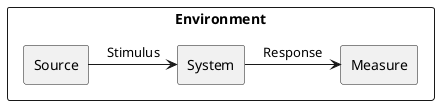

*Stimulus*: condition affecting the system

*Source*: entity generating the stimulus

*Environment*: context under which stimulus occurred (e.g., build, test, deployment, startup, normal operation, overload, failure, attack, change)

*Response*: observable result of the stimulus

*Measure*: benchmark or target value defining a successful response

Pass: 3 scenarios

Good: >3 scenarios

Exceed: >6 scenarios using challenging qualities

}


## Example Scenario

Quality: _Recoverability_

Scenario: In case of power failure, rebooting the system should take up to 20 seconds.

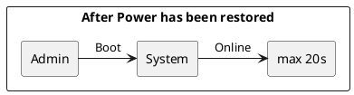


#::::::::::::::::::::::::::::::::::::::::::::::::::::::::::::::::::::::::::::::

## ADR #1

1. What did you decide?

Which platform should Skip run on.

2. What was the context for your decision?

We want to guarantee Skip users a good compromise of usability and utility at a
reasonable development cost.

The application should be as immediate as possible to access and push users to
give updates on the conditions of the slopes.

Another important factor to keep in mind is the 'effort' that would be required
from the users part to start using the application for instance using a web app
doesn't require any installations.

This is a key decision that affects the marketing and design architecture of
the whole software:


* From a coding perspective programming languages available across platforms
are not the same. We also need to keep in mind that available computing power
vastly differs platform to platform

* Best UI practices vastly differs on different platforms for instance a phone
has a smaller screen size and ratio compared to a desktop PC

* There are revenue consequences based on these decisions, for instance mobile
app stores will take a portion of our profits but at the same time offer a more
ample access to the marketing


3. What is the problem you are trying to solve?

What's the best way for users to access our service?

4.  Which alternative options did you consider?

* Web app
* Mobile app
* Desktop
* Mobile + Desktop

5. Which one did you choose?

Mobile

6. What is the main reason for that?

Users need an interface to quickly access the applicable features and give updates
on the condition of the snow while on the slopes. Given most users will go skiing
with their smartphones rather than their computers we need to make the app available
on them. We can do so either via web app or mobile application, web apps tend to
be hard to use while on the snow so we need at least mobile app.

The application doesn't feature complex user interactions that would justify
the need of a desktop version. We also need to consider that a user from a Desktop
might use the app to evaluate the condition of the slopes but likely won't come
back home to open it again to provide feedback on their conditions which is something
our application needs.

PROS:

* not developing also a Desktop app saves component
* the app store gives a large market access on the fly
* the application will be easily accessible while skiing
* it's easier to have a good design on a mobile app rather than a web apps


CONS:

* revenue cut by app stores
* users without a smartphone won't be able to access the application
* more effort required from the users part to start using the application compared
to a web app
* more expensive to develop a web app compared to a mobile one


## ADR #2

1. What did you decide?

Which mobile OS should the application run on?

2. What was the context for your decision?

We want our application to be accessible to the largest possible amount of users.
We need to consider that developing an app on multiple OS has a considerable impact
on developing costs.
Different technologies are available on different OS so this choice will impact
our code.


3. What is the problem you are trying to solve?

How can we make the application available to a large portion of our potential
users without a heavy impact on its usability and development costs?


4.  Which alternative options did you consider?

* Android
* IoS
* X-platform
* (Android & IoS) native

5. Which one did you choose?

X-platform

6. What is the main reason for that?

Excluding on of the OS would cut out a significant portion of our users as currently
the split between Android/Apple devices is roughly 7:3.
A x-platform solution allows to access both markets while at the same time
not bloating maintenance and development costs.
The tradeoff is in usability.

PROS:

* access to nearly all potential users
* less expensive compared to a native solution

CONS:

* more expensive compared to a single OS solution
* no access to native OS specific features


## ADR #3

1. What did you decide?

Which framework to use to implement the X-platform app.

2. What was the context for your decision?

Developing the application with a feature rich and reliable framework will
reduce costs and deliver a better product.

Programmers need to be able to work with the framework thus either they are
already comfortable with it or they will need to learn how to use it.

This decision has an impact on the code design.


3. What is the problem you are trying to solve?

How can we make our app as easy to implement as possible?

4.  Which alternative options did you consider?

* React native
* Flutter

5. Which one did you choose?

Not enough information to pick one yet. Further options need to be explored.

6. What is the main reason for that?

//


## ADR #4

1. What did you decide?

How we should gain money from the application

2. What was the context for your decision?

We need to make a profit from our application.

We need to consider that certain solution will impact the amount of users of the
application (ex: making the app paid) or impact the usability (ex: aggressive ads)

This decision is a marketing one but might slightly impact UI design and code if
we want to add ads to the application. For donations we will need to implement
a secure way to send them code-wise.


3. What is the problem you are trying to solve?

How can we profit from the application?

4.  Which alternative options did you consider?

* paid application
* free application with ads
* free application with donations

5. Which one did you choose?

free application with ads

6. What is the main reason for that?

An application can only be paid if it offers a service indispensable for the
user while at the same time being by far the best
product available on the market (ex: photoshop).
Users will be very shy to download a paid app on the a mobile store in part given
the fierce competition on it.
That being said making the app paid would surely reduce the amount of users
in turn reducing the amount of snow updates we get from them.

At the cost of some usability ads can provide a steady flow of revenue without
the big barrier on the download an initial payment would be. We could also
consider the option to remove ads with a payment.

Donations don't impact the usability of the app but likely don't provide enough
revenue. More research would be needed on this topic to confirm it as there seem
to be conflicting opinions on the topic.


PROS:

* steady flow of revenue
* no download barrier

CONS:

* usability tradeoff
* need to change UI to fit ads


## ADR #5

1. What did you decide?

How to incentivise users to give snow updates

2. What was the context for your decision?

We want users to provide as much updates on the condition of the snow as possible
to offer consistent and up to date reports.

We can't make the feedback too long or invasive or users won't compile it.

The incentives can't heavily impact the profits of our application.

This is a marketing decision with a minor impact on the code of the application
albeit way to give incentives will have to be implemented.

3. What is the problem you are trying to solve?

Users might not provide updates if they don't feel they gain something from it.
At the same time an incentive perceived as too large might prompt them to
leave fake updates

4.  Which alternative options did you consider?

* no incentives
* small payment
* lottery

5. Which one did you choose?

lottery

6. What is the main reason for that?

By providing no incentives it would be up to the user's goodwill to leave updates
which might still happen (reviews exist even if no one gets paid for them).

We could issue small payment to users for their updates but these payments would
be so small in order to still manage to make a profit off the app that users might
perceive them as a 'job' they are not getting paid enough to do.

A lottery of ski related items might be the best options since it doesn't cost
much compared to the perceived value from the user's part and might also introduce
the fun factor.

PROS:
* incentive for the users

CONS:

* lotteries have to abide legal regulations
* lottery still impacts operating costs albeit in a minor way
* it might incentivise users to leave fake updates. A countermeasure needs to be
designed.


# Ex - Quality Attribute Tradeoff

{.instructions

Pick a free combination of two qualities on the [map](https://usi365.sharepoint.com/:x:/s/MSDE-2022-SoftwareArchitecture/ESVksoXVgMNHtKBKrIwatMYBqorOFaKjxnoqssEy0gNPCg?e=81W7SI) and write your name to claim it.

Then write a short text giving an example for the tradeoff in this assignment.

Pass: 1 unique trade-off

Good: 2 trade-offs

Exceed: >2 trade-offs

}


#:


## Example Scenario 1

Quality: _Affordability_ , _Portability_ , _Deployability_

Scenario: The code written for the application is compatible with both Android
and IoS  with none or relatively trivial changes costing little effort,
time and money to be deployed on both OS at the same time once the code is written.

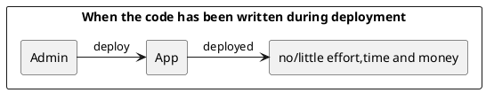


## Example Scenario 2

Quality: _Interoperability_ , _Usability_

Scenario: The software should be able to fetch data from multiple weather APIs
in order to provide users with reliable data over a vast amount of locations.
The fetching and elaboration of this data to a usable summary should be done
server side for efficiency and speed.
 Our server should act as an adaptor over the whole data for the application.

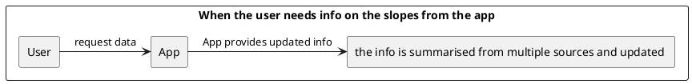


## Example Scenario 3

Quality: _Usability_ , _Performance_

Scenario: The survey the user completes to provide the us with updates on
snow conditions should on average take less than 30s to complete.

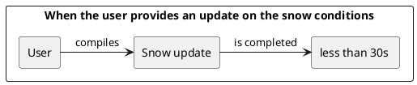


## Example Scenario 4

Quality: ? maybe it's functional ?

Scenario: The application should be able to store a snow update in case of
poor connection (as often is on the slopes) for at least a few hours and send
the data later to our server without having the user compile another snow update.


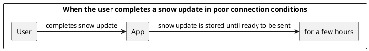


## Example Scenario 5

Quality: _Availability_

Scenario: The application should have an uptime of at least 99.5% for weather
and slope info assuming a connection is available.

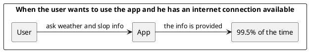


## Example Scenario 6

Quality: _Deployability_ , _Maintainability_

Scenario: The whole software (app + server) should have a test coverage of
at least 95% when deployed and for its whole lifecycle.

Without said requirement an automatic pipeline should fail the deployment.


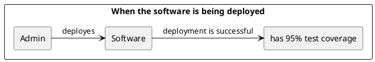


## Example Scenario 7

Quality: _Visibility_ , _Maintainability_ , _Privacy_

Scenario: When the service of the App is not available the application should
show the user a clear message stating the reason. If the reason is a fault in
the software a log should be sent to the developer not containing sensible user
data.


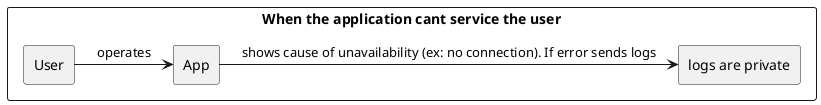


# Ex - Feature Modeling

{.instructions

In the context of your chosen project domain, describe your domain using a feature model.

The feature model should be correctly visualized using the following template:


If possible, make use of all modeling constructs.

Pass: Include at least 4 non-trivial features

Good: Include at least 6 non-trivial features, which are all implemented by your project

Exceed: Include more than 8 non-trivial features, indicate which are found in your project and which belong to one competitor

}


#:::::::::::::


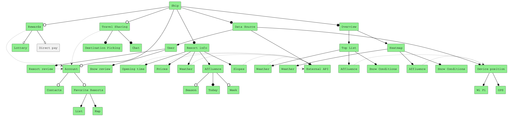


# Ex - Context Diagram

{.instructions

Prepare a context diagram to define the design boundary for your project.

Here is a PlantUML/C4 example to get started.


Make sure to include all possible user personas and external dependencies you may need.

Pass: 1 User and 1 Dependency

Good: >1 User and >1 Dependency

Exceed: >1 User and >1 Dependency, with both incoming and outgoing dependencies

}


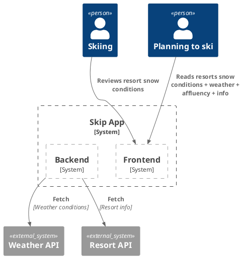


# Ex - Component Model: Top-Down

{.instructions

Within the context of your project domain, represent a model of your modular software architecture decomposed into components.

The number of components in your logical view should be between 6 and 9:

- At least one component should be further decomposed into sub components
- At least one component should already exist. You should plan how to reuse it, by locating it in some software repository and including in your model the exact link to its specification and its price.
- At least one component should be stateful.

The logical view should represent provide/require dependencies that are consistent with the interactions represented in the process view.

The process view should illustrate how the proposed decomposition is used to satisfy the main use case given by your domain model.

You can add additional process views showing how other use cases can be satisfied by the same set of components.

This assignment will focus on modularity-related decisions, we will worry about deployment and the container view later.

Here is a PlantUML example logical view and process view.

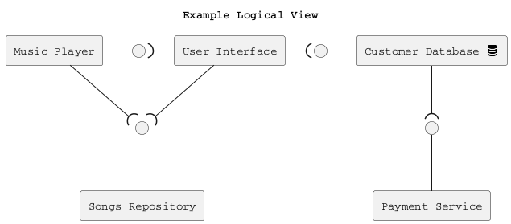

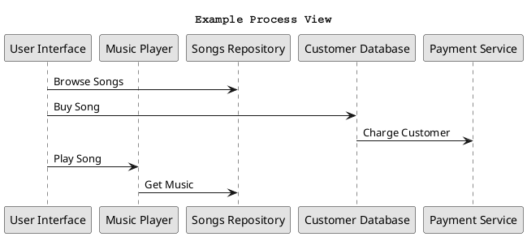

Hint: How to connect sub-components to other external components? Use this pattern.

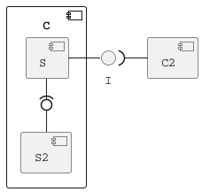

Pass: 6 components (1 decomposed), 1 use case/process view

Good: 6 components (1 decomposed), 2 use case/process view

Exceed: >6 components (>1 decomposed) and >2 use case/process view

}


#:


## Logical View

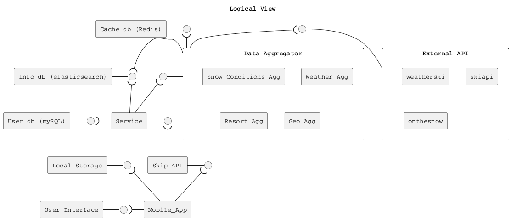


## Process Views


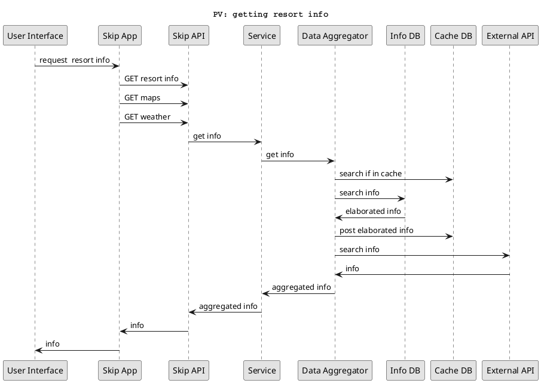


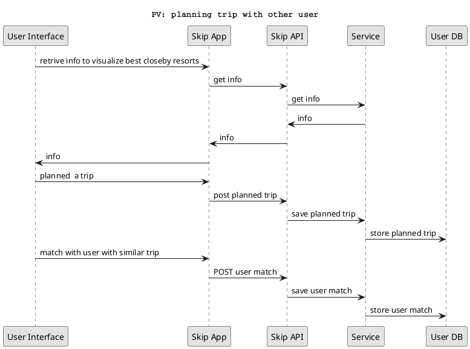


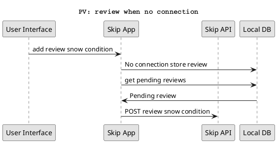


``` 
"Data aggregator" and "External API" sub-components are not connected. 
```

# Ex - Component Model: Bottom-Up

{.instructions

Within the context of your project domain, represent a model of your modular software architecture decomposed into components.

To design this model you should attempt to buy and reuse as many components as possible.

In addition to the logical and process views, you should give a precise list to all sources and prices of the components you have selected to be reused.

Write an ADR to document your component selection process (indicating which alternatives were considered).

Pass: Existing design with at least 1 reused components (1 Logical View, 1 Process View)

Good: Existing design with at least 3 reused components (1 Logical View, 1 Process View, 1 ADR)

Exceed: Redesign based on >3 reused components (1 Logical View, >1 Process View, >1 ADR)

}


# Ex - Interface/API Specification

{.instructions

In this iteration, we will detail your previous model to specify the provided interface of all components based on their interactions found in your existing process views.

1. choose whether to use the top down or bottom up model. If you specify the interfaces of the bottom up model, your interface descriptions should match what the components you reuse already offer.

2. decide which interface elements are operations, properties, or events.

Get started with one of these PlantUML templates, or you can come up with your own notation to describe the interfaces, as long as it includes all the necessary details.

The first template describes separately the provided/required interfaces of each component.


The second template annotates the logical view with the interface descriptions: less redundant, but needs the logical dependencies to be modeled to show which are the required interfaces.


Pass: define interfaces of all outer-level components

Good: Define interfaces of all outer-level components. Does your architecture publish a Web API? If not, extend it so that it does.

Exceed: Also, document the Web API using the OpenAPI language. You can use the [OpenAPI-to-Tree](http://api-ace.inf.usi.ch/openapi-to-tree/) tool to visualize the structure of your OpenAPI description.

}

# Ex - Connector View

{.instructions

Extend your existing models introducing the connector view

For every pair of connected components (logical view), pick the most suitable connector. Existing components can play the role of connector, or new connectors may need to be introduced.

Make sure that the interactions shown in the process views reflect the primitives of the selected connector

Pass: model existing connectors based on previous model decisions

Good: model existing connectors based on previous model decisions, write an ADR about the choice of one connector

Exceed: introduce a new type of connector and update your existing process view
(sequence diagram) to show the connector primitives in action

}

# Ex - Adapters and Coupling

{.instructions

1. Highlight the connectors (or components) in your existing bottom-up design playing the role of adapter. (We suggest to use the bottom-up design since when dealing with externally sourced components, their interfaces can be a source of mismatches).
2. Which kind of mismatch** are they solving?
3. Introduce a wrapper in your architecture to hide one of the previously highlighted adapters
4. Where would standard interfaces play a role in your architecture? Which standards could be relevant in your domain?
5. Explain how one or more pairs of components are coupled according to different coupling facets
6. Provide more details on how each adapter solves the mismatches identified using pseudo-code or the actual code
7. How can you improve your architectural model to minimize coupling between components? (Include a revised logical/connector view with your solution)

Pass: 1-5 (with one adapter)

Good: 1-6 (with at least two adapters)

Exceed: 1-7 (with at least two adapters)

** If you do not find any mismatch in your existing design we suggest to introduce one artificially.

## Hints

* (1) Should we find cases where two components cannot communicate (and are doing it wrongly) and highlight they would need an adapter?, or cases where we have already a "component playing the role of adapter in the view" and highlight only the adapter?

  *Both are fine. We assumed that if you draw a dependency (or a connector) the interfaces match, but if you detect that the components that should communicate cannot communicate then of course introduce an adapter to solve the mismatch*

* (2) Please show the details about the two interfaces which do not match (e.g., names of parameters, object structures) so that it becomes clear why an adapter is needed and what the adapter should do to bridge the mismatch

* (5-6) These questions are about the implications on coupling based on the decisions you documented in the connector view.
Whenever you have a connector you couple together the components and different connectors will have different forms of coupling

  For example, if you use calls everywhere, do you really need them everywhere? is there some pair of components where you could use a message queue instead?

  Regarding the coupling facets mentioned in question 5. You do not have to answer all questions related to "discovery", "session", "binding", "interaction", "timing", "interface" and "platform" (p.441, Coupling Facets). Just the ones that you think are relevant for your design and by answering them you can get ideas on how to do question 6.

}

# Ex - Physical and Deployment Views

{.instructions

a. Extend your architectural model with the following viewpoints:

1. Physical or Container View

2. Deployment View

Your model should be non-trivial: include more than one physical device/virtual container (or both). Be ready to discuss which connectors are found at the device/container boundaries.

b. Write an ADR about which deployment strategy you plan to adopt. The alternatives to be considered are: big bang, blue/green, shadow, pilot, gradual phase-in, canary, A/B testing.

c. (Optional) Prepare a demo of a basic continuous integration and delivery pipeline for your architectural documentation so that you can obtain a single, integrated PDF with all the viewpoints you have modeled so far.

For example:

- configure a GitHub webhook to be called whenever you push changes to your documentation
- setup a GitHub action (or similar) to build and publish your documentation on a website

Pass: 1 physical view, 1 deployment view, 1 ADR (b.)

Good: >1 physical view, >1 deployment view, 1 ADR (b.)

Exceed: 1 physical view, 1 deployment view, 1 ADR (b.) + 1 demo (c.)

}

# Ex - Availability and Services

{.instructions

The goal of this week is to plan how to deliver your software as a service with high availability.

1. If necessary, change your deployment design so that your software is hosted on a server (which could be running as a Cloud VM). Your SaaS architecture should show how your SaaS can be remotely accessed from a client such as a Web browser, or a mobile app
2. Sketch your software as a service pricing model (optional)
3. How would you define the availability requirements in your project domain? For example, what would be your expectation for the duration of planned/unplanned downtimes or the longest response time tolerated by your clients?
4. Which strategy do you adopt to monitor your service's availability? Extend your architecture with a watchdog or a heartbeat monitor and motivate your choice with an ADR.
5. What happens when a stateless component goes down? model a sequence diagram to show what needs to happen to recover one of your critical stateless components
6. How do you plan to recover stateful components? write an ADR about your choice of replication strategy and whether you prefer consistency vs. availability. Also, consider whether event sourcing would help in your context.
7. How do you plan to avoid cascading failures? Be ready to discuss how the connectors (modeled in your connector view) impact the reliability of your architecture.
8. How did you mitigate the impact of your external dependencies being not available? (if applicable)

Pass: 1, 3, 4, one of:  5, 6, 7, 8

Good: 1, 2, 3, 4, two of:  5, 6, 7, 8

Exceed: 1, 2, 3, 4, 5, 6, 7, 8

}

# Ex - Scalability

{.instructions

Now that your architecture delivers your software as a service, let's redesign it so that it can scale!

1. Pick one scalability dimension: number of clients, size of input, size of state, number of dependencies

2. How well does your architecture scale along the chosen dimension? Where do you expect the bottleneck to be?

3. Modify your architecture to remove the scalability bottleneck you have identified (show both logical, process and deployment view) - consider whether the API/interface of the bottleneck component should be improved.

4. Write an ADR regarding the scalability pattern you have introduced.

5. Write an ADR regarding the issue of component discovery, choosing one of the alternatives: dependency injection vs. directory. Can you identify an existing component playing the role of directory/dependency injection container? Could you give an example of where you would need to add such component to facilitate dynamic component discovery?

Pass: 1, 2, 3, 5

Good: 1, 2, 3, 4, 5

Exceed: 1, 2, 3, 4, 5 then redo 1, 2, 3 for different scalability dimensions

}

# Ex - Flexibility

{.instructions

Only dead software stops changing. You just received a message from your customer, they have an idea. Is your architecture ready for it?

1. Pick a new use case scenario. Precisely, what exactly do you need to change of your existing architecture so that it can be supported? Model the updated logical/process/deployment views.

2. Pick another use case scenario so that it can be supported without any major architectural change (i.e., while you cannot add new components, it is possible to extend the interface of existing ones or introduce new dependencies). Illustrate with a process view, how your previous design can satisfy the new requirement.

3. Change impact. One of your externally sourced component/Web service API has announced it will introduce a breaking change. What is the impact of such change? How can you control and limit the impact of such change? Update your logical view

4. Open up your architecture so that it can be extended with plugins by its end-users. Where would be a good extension point? Update your logical view and give at least one example of what a plugin would actually do.

5. Assuming you have a centralized deployment with all stateful components storing their state in the same database, propose a strategy to split the monolith into at least two different microservices. Model the new logical/deployment view as well as the interfaces of each microservice you introduce.

Pass: 1, one out of 2-5.

Good: 1, two out of 2-5.

Exceed: 1-5.

}
